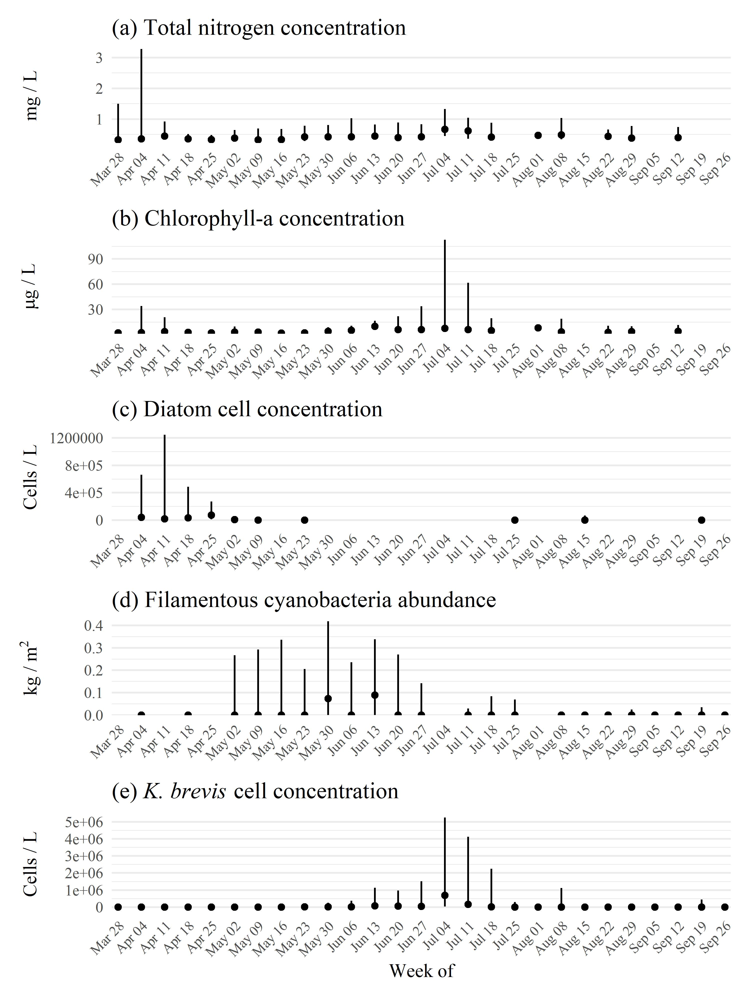

```{r setup, echo = F, warning = F, message = F, results = 'hide'}
# figure path, chunk options
knitr::opts_chunk$set(fig.path = 'figs/', warning = F, message = F, echo = F, cache = F, dev.args = list(family = 'serif'), dpi = 300, warning = F,
  fig.process = function(x) {
  x2 = sub('-\\d+([.][a-z]+)$', '\\1', x)
  if (file.rename(x, x2)) x2 else x
  })

box::use(
  here[here],
  dplyr[...],
  tidyr[fill],
  english[english], 
  lubridate[month,year,mdy,floor_date], 
  tibble[deframe]
)

data(rswqdat)
data(rstrnpts)
data(rstrndat)
data(trnsum)
data(tnanndat)

load(file = here('tables/wqsumtab.RData'))
load(file = here('tables/stktab.RData'))
load(file = here('tables/wqcmptab.RData'))

maxdt <- as.Date('2021-10-01')

# seagrass transect counts
ntrnscnt <- length(unique(rstrndat$station))
ntrns <- english(ntrnscnt)

# # extract bib entries from online
# bib_scrp('manu_draft.Rmd', 'refs.bib')
```

`r paste('Last manuscript build', Sys.time())`

```{r echo = F, cache = F, eval = F}
spelling::spell_check_files('manu_draft.Rmd')
```

# Abstract

Aging infrastructure and climate change stressors acting on wastewater containment facilities are global concerns for the environmental protection of surface waters.  From March 30th to April 9th, 2021, 814 million liters of mixed legacy phosphate mining wastewater and marine dredge water from the Piney Point facility were released into Tampa Bay (Florida, USA).  An estimated 186 metric tons of total nitrogen were exported to Lower Tampa Bay, exceeding typical annual external nitrogen loads in a matter of days.  In the period immediately after the release, elevated levels of phytoplankton (non-harmful diatoms) were observed in the nearshore regions of the lower Bay. Filamentous cyanobacteria blooms (*Dapis* spp.) peaked in June, followed by blooms of the red tide organism *Karenia brevis* that peaked in July.  Reported fish kills tracked *K. brevis* concentrations, prompting local cleanup efforts to remove over 1600 metric tons of dead fish.  By comparing these observations to decades of baseline environmental monitoring data for the region and typical seasonal conditions experienced in recent years, we conclude that all of these biological responses, observed after the release from Piney Point, are abnormal relative to historic conditions in Tampa Bay.

*Key words*: eutrophication, macroalgae, nitrogen, phosphate mining, seagrass, Tampa Bay

# Introduction

Wastewater byproducts from mining are a global threat to the quality of surface and groundwater resources [@Tayibi09;@Hudson11]. Phosphate fertilizer is produced through the "wet process" reaction to create phosphoric acid by treating mined phosphate rock with sulfuric acid [@Burnett01;@Perez16].  The process generates large amounts of waste, creating approximately one unit of phosphoric acid per five units of phosphogypsum waste (CaSO$_4\cdot$ H$_2$O).  This waste is typically stored on-site in large earthen stacks (gypstacks) capable of holding millions of liters of process water.  Water quality in gypstacks can vary depending on processing method used at the mining facility, background geological characteristics of the region, and on-site practices for managing stormwater or other activities that can introduce additional materials to the holding ponds [@Henderson04;@Perez10].  In addition to elevated phosphorus concentrations, other nutrients, contaminants, and radionuclides may be present at values much higher than those of natural surface waters [@Burnett01;@Beck18b]. Many of these gypstacks no longer support active mining and aging infrastructure combined with climate change related stressors (e.g., heavy precipitation events) have reduced the capacity of these facilities to maintain water on site. Environmental and human health risks associated with these stacks can occur through controlled or uncontrolled releases to surface waters or groundwater contamination through leaching from unlined or poorly maintained stacks [@Tayibi09;@Sanders13;@elzrelli15;@Perez16;@Beck18b].   

Ongoing threats and challenges to protecting water quality of northern Gulf of Mexico estuaries persist despite recent environmental recovery.  Successful restoration has been accomplished through ecosystem management paradigms that are based primarily on the control of nutrient pollutants from atmospheric deposition, stormwater, and wastewater.  Nitrogen inputs from external sources are well understood as drivers of algal blooms in coastal environments that can degrade water quality, having a negative effect on inter- and subtidal habitats [@Nixon95;@Howarth06;@Parker12;@Greening14]. Seagrasses in particular are valuable habitat-defining species that provide many ecosystem services, but are especially vulnerable to the impacts of nutrient pollution on water quality because of cascading effects of nitrogen, phytoplankton growth, water clarity, light limitation, and epiphytic growth that can eliminate seagrass from nearshore environments [@Dixon95;@Kenworthy96;@Greening06;@Beck18a].  Historical gains in seagrass coverage in southwest Florida estuaries (e.g., Tampa Bay, Sarasota Bay, Charlotte Harbor) have been achieved through public-private partnerships and consensus-based approaches to science applications that seek to limit the total nutrient loads delivered to surface waters [@Janicki96;@Greening16;@Tomasko18;@Tomasko20].  Together, these efforts have resulted in the long-term recovery of Tampa Bay and other Gulf Coast estuaries through a reduction in external nitrogen loads, improvements in water clarity, and baywide expansion of seagrass coverage to benchmark targets established for the region [@Greening14;@Sherwood17]. The three contiguous National Estuary Programs of southwest Florida and their partners have been instrumental in coordinating efforts to address legacy pollutants and current threats to the long-term protection of estuarine resources.

The geology of central Florida is rich in phosphates that have supported a multi-billion dollar mining industry for fertilizer to support agricultural production in other countries [@Henderson04].  By 2001, an estimated 36 million metric tons of phosphogypsum were created each year in northern and central Florida [@Burnett01].  Currently, seventeen phosphogypsum stacks exist in the Tampa Bay watershed.  Effective management and final closure of these facilities are imperative to reduce threats to prior ecosystem recovery efforts and investments. The Piney Point facility located in Palmetto, Florida is a large, remnant gypstack with three holding ponds located 3 kilometers from the shore of Tampa Bay and near two Florida Aquatic Preserves [see supplement for a history of the facility, @Henderson04].   Holding capacity of the ponds has decreased over time from seasonal rain events, tropical storms, and storage of dredging material from nearby Port Manatee.  Unanticipated releases from the stacks occurred in the early 2000s and in 2011 to nearby Bishop Harbor connected to Tampa Bay.  Those releases resulted in spatially-restricted, ecosystem responses including localized harmful algal blooms and increased macroalgal abundance [@Switzer11;@Garrett11]. 

Recently, leakages were detected from a tear in the plastic liner of the southern holding pond (NGS-S) at Piney Point.  In response, the Florida Department of Environmental Protection (FDEP) authorized an [emergency order](https://floridadep.gov/sites/default/files/21-0323.pdf) on March 29th, 2021 to release water from the southern gypstack directly into lower Tampa Bay to prevent catastrophic failure of the facility. At that time, approximately 1.8 billion liters of mix legacy phosphate mining wastewater and seawater from port dredging operations was being held in the failing gypstack.  Water quality parameters of NGS-S measured in 2019 were well above baseline conditions typical of surface waters in Tampa Bay, particularly for total phosphorus (160 mg/L) and total nitrogen (230 mg/L). From March 30th to April 9th, approximately 814 million liters (215 million gallons) of stack water were released to lower Tampa Bay.  Over this ten day period, an estimated 186 metric tons (205 tons) of nitrogen were delivered to the bay, exceeding contemporary annual estimates of external nutrient loads to lower Tampa Bay in a matter of days [@tbep0417].    
  
This paper provides an initial assessment of environmental conditions in Tampa Bay over six months following the recent release of legacy phosphate mining wastewater from March 30th to April 9th, 2021.  The goal is to describe the results of monitoring data of surface waters collected in response to the event to assess relative deviation of current conditions from long-term, seasonal records of water quality, phytoplankton, and seagrass/macroalgae datasets available for the region. We focus on nitrogen inputs as the identified limiting nutrient for Tampa Bay and its potential to create water quality conditions unfavorable for seagrass growth due to enhanced algal production.  A timeline of events in 2021 is provided, which is supported by the quantitative results from 2021 response-based monitoring of conditions in and around Port Manatee, FL -- the focal point of emergency releases from the Piney Point facility.  The results from this paper provide examples of anticipated short-term responses to acute nutrient loadings from legacy mining facilities in the broader context of historical conditions that may influence system response to these events. 

# Methods    

## Monitoring response to the emergency release

Monitoring of the natural resources of Tampa Bay in response to the release from Piney Point began in April, 2021 and continued for six months through September. These data were collected through a coordinated effort under the guidance of a plume simulation by a numerical circulation model run by the Ocean Circulation Lab at the University of South Florida (USF), College of Marine Science.  The plume evolution from Piney Point was simulated using the Tampa Bay Coastal Ocean Model (TBCOM) nowcast/forecast system [@Chen18;@Chen19], with an embedded tracer module that included realistic release rates. Normalized tracer distributions were automatically updated each day, providing 1-day hindcasts and 3.5-day forecasts throughout the period of discharge and subsequent Tampa Bay distribution. The modeled plume evolution web product (Y. Liu, R.H. Weisberg, J. Chen, Y. Sun, personal communication) served as the principal guidance for coordinating the data collection during the event. 

Monitoring agencies and local partners that collected data using standardized protocols included FDEP, Environmental Protection Commission (EPC) of Hillsborough County, Parks and Natural Resources Department of Manatee County, Pinellas County Division of Environmental Management, Fish and Wildlife Research Institute of the Florida Fish and Wildlife Conservation Commission (FWC), City of St. Petersburg, Tampa Bay Estuary Program (TBEP), Sarasota Bay Estuary Program, Environmental Science Associates, University of South Florida, University of Florida, and New College of Florida. Monitoring efforts focused on a suite of parameters expected to respond to increased nutrient loads into the bay, including water quality sampling, phytoplankton identification, and seagrass and macroalgae transect surveys (Figure \@ref(fig:map)).  In short, water quality parameters included discrete, laboratory-processed and *in situ* samples for total nitrogen (mg/L), total ammonia nitrogen (NH$_3$ + NH$_4^+$, mg/L), nitrate/nitrite (NO$_3^-$ + NO$_2^-$, mg/L), total phosphorus (mg/L), orthophosphate (PO$_4^{3-}$, mg/L), chlorophyll-a (ug/L), pH, salinity (psu), temperature (C), and dissolved oxygen saturation (\%).  Most samples were surface collections by boat, with sample frequency approximately biweekly for locations around Piney Point.  Phytoplankton samples included a mix of quantitative (cells/l) and qualitative (presence/absence) samples for major taxa at similar frequency and spatial distribution as the water quality samples. Seagrass and macroalgae sampling occurred approximately biweekly at `r ntrns` transects using a modified rapid assessment design following the "[Eyes on Seagrass](http://blogs.ifas.ufl.edu/news/2019/03/19/citizen-scientists-needed-to-survey-seagrass-seaweed-in-charlotte-harbor/)" method developed by a local citizen science group in cooperation with academic and federal partners.  Details of the sampling methods are provided in supplement. 

## Data Analysis

```{r}
seconb <- rswqdat %>% 
  filter(date < maxdt) %>% 
  filter(var == 'secchi') %>% 
  filter(source == 'fldep') %>% 
  pull(qual) %>% 
  grepl('S', .)
sumb <- sum(seconb)
totb <- length(seconb) 
```

Long-term water quality monitoring data from Hillsborough and Manatee counties (accessible at https://wateratlas.usf.edu/) were used to establish baseline conditions for major areas of interest in Figure \@ref(fig:map)a to compare with the response monitoring data described above. These areas (Area 1: closest to Piney Point; Area 2: north of Piney Point; Area 3: south of Piney Point including northern Sarasota Bay) were identified based on anticipated impacts from expected plume patterns following the TBCOM simulations and other prominent bay boundaries relative to Piney Point (i.e., the main shipping channel in the bay, inflow boundaries, location of the Skyway Bridge at the mouth of Tampa Bay, and major bay segments used by TBEP for assessing programmatic goals). Observations at each long-term monitoring station were averaged for each month across years from 2006 to 2020. This period represents a "recovery" stage for Tampa Bay where water quality conditions were much improved from historical conditions during a more eutrophic period and when seagrass areal coverage was trending towards and above a 1950s benchmark target of 15,378 hectares [38,000 acres, @Greening14;@Sherwood17].  For each month, the mean values +/- 1 standard deviation for each parameter at each station were quantified and used as reference values relative to results at the closest water quality monitoring station that was sampled in response to Piney Point.  This comparison was made to ensure that the response data were evaluated relative to stations that were spatially relevant (e.g., long-term conditions near the mouth of Tampa Bay are not the same as those in the middle of the bay) and seasonally-specific (e.g., historical conditions in April are not the same as historical conditions in July). In some cases, the nearest long-term station did not include data for every monitoring parameter at a response location and the next closest station was used as a reference.  The average distance from a monitoring location in 2021 to the long-term sites was 1.6 km (see https://shiny.tbep.org/piney-point/ for a map of the matches).

The historical monitoring data were also used to model an expected seasonal pattern for water quality parameters from April to October in 2021.  This was done by estimating smoothed annual and seasonal splines with Generalized Additive Models (GAMs) using data only from the "recovery" stage of Tampa Bay (2006 to 2020).  GAMs were used to model time series of water quality parameters as a function of a continuous value for year (i.e., decimal year) and as an integer value for day of year. The continuous year value was modeled with a thin plate regression spline and the day of year value was modelled with a cyclic spline [following similar methods @Murphy19].  The modeled results provided an estimate of the expected normal seasonal variation that takes into account a long-term annual trend.  Differences in the observed values sampled in the April to October time periods from the "forecasted" predictions of the baseline GAMs through 2021 provided an assessment of how the current data may have deviated from historical and normal seasonal variation. 

Statistical assessments were evaluated only on total nitrogen (TN), chlorophyll-a (chl-a), and Secchi disk depth as a general analysis of potential patterns in eutrophication in nitrogen-limited systems. Observations for each data type were typically aggregated to the weekly or monthly scale given that sampling occurred on different days during the six month period.  Spatial comparisons were based primarily on the three areas identified in Figure \@ref(fig:map)a. Variables with log-normal distributions were log$_10$-transformed (i.e., nutrients, chl-a) prior to analysis.  For statistical tests using water quality data, only the monitoring results from FDEP were used for analysis given the consistency of sample location and collection dates. For censored data (i.e., above or below detection), Secchi observations that were visually identified on the bottom (`r sumb` of `r totb` observations in the FDEP data) were removed from analysis, whereas all other non-detects that were below laboratory standards of detection were evaluated with methods described below. 

Differences in observations between months for water quality, seagrass, and macroalgae within each area (Figure \@ref(fig:map)a) were evaluated using a Kruskal-Wallis one-way analysis of variance (ANOVA) followed by multiple comparisons using 2-sided Mann-Whitney U tests [@Hollander13]. Probability values were adjusted using the sequential Bonferroni method described in [@Holm79] to account for the increased probability of Type I error rates with multiple comparisons. An adjusted p-value < 5\% ($\alpha$ = 0.05) was considered a significant difference between months.  For water quality variables, monthly averages from long-term monitoring data were subtracted from 2021 observations to account for normal seasonal variation not attributed to potential effects from Piney Point.  Similar corrections were not done for monthly comparisons of seagrass and macroalgae data because comparable long-term seasonal data do not exist. Methods to accommodate measured concentrations of water quality variables that were below detection were used that included summary statistics (e.g., median, mean, and standard deviation) following estimates of the empirical cumulative distribution functions for each parameter using the Kaplan-Meier method for censored data [@Helsel05;@Lee20].

The R statistical programming language (v4.0.2) was used for all analyses [@RCT20].  We imported data using the googlesheets4 [@Bryan20] and googledrive [@DAgostino20] R packages and used tidyverse [@Wickham19] packages to format data for analysis.  The tbeptools R package [@Beck21] was used to import and summarize long-term monitoring data (EPC water quality data and seagrass transect data). The NADA R package [@Lee20] was used for analysis of censored data. All spatial analyses were done using the simple features (sf) R package [@Pebesma18]. The mgcv R package [@Wood17] was used to create the GAMs for water quality parameters.

# Results

## Timeline of 2021 biological response events

A general summary of 2021 events in Tampa Bay following discharge from Piney Point is shown in Figure \@ref(fig:timeline). After the discharge ceased on April 9th, a peak in median chl-a concentration was observed near Piney Point (Area 1, Figure \@ref(fig:map)a) mid-April, with peak individual sample values in excess of 50 ug/L. Median concentrations for each week in April were less than 10 ug/L.  The discharge phytoplankton biomass was comprised of over 99% of a spherical nanoplanktonic chlorophyte, with density of 337 x 10$^6$ cells/L. The phytoplankton communities near the discharge area in April were generally dominated by diatoms (Bacillariophyta). The initial diatom bloom did not persist past April.  On April 20th, the toxic red tide species *Karenia brevis* was first observed near Anna Maria Sound at the southern edge of the mouth of Tampa Bay.  By May/June, bloom levels of *K. brevis* were observed, with peak concentrations in excess of 1 x 10$^6$ cells/L in lower Tampa Bay.  Also during May/June, high abundances of benthic filamentous cyanobacteria (*Dapis* spp.) were observed in Anna Maria Sound (Area 3) and near Port Manatee (Area 1).  High levels of cyanobacteria coverage on benthic and seagrass habitats were observed, in addition to large floating mats on the surface. By June 27th, fish kill reports attributed to red tide increased with *K. brevis* cell concentrations in lower and middle Tampa Bay.  The center of tropical storm Elsa passed to the west of Tampa Bay on July 5th, causing a shift in prevailing winds from the southeast.  This shift contributed to an increase in fish kill reports by moving dead fish closer to heavily populated areas of Tampa Bay, specifically near the cities of St. Petersburg and Tampa. Concentrations of *K. brevis* in middle and lower Tampa Bay peaked in early to mid July, with bloom conditions not observed in the bay after July.  Conditions were relatively stable in August and September compared to months prior. A quantitative description of these events follows. 

## Water quality trends

```{r}
nwq <- sum(wqsumtab[['N obs.']])
outrng1 <- wqsumtab %>% 
  filter(`Water quality variable` == 'Secchi (m)') %>% 
  pull(`% Below`) %>%  
  sum
outrng2 <- wqsumtab %>% 
  filter(`Water quality variable` != 'Secchi (m)') %>% 
  pull(`% Above`) %>%  
  sum
outrng <- round(100 * (sum(outrng1, outrng2) / nwq), 0)

# percentages out of range
wqsumfl <- wqsumtab %>% 
  mutate(
    Area = ifelse(Area == '', NA, Area)
  ) %>% 
  fill(Area) 
chlabv <- wqsumfl %>% 
  filter(`Water quality variable` == 'Chl-a (ug/L)') %>% 
  select(Area, `% Above`) %>% 
  deframe %>% 
  round(0)
tnabv <- wqsumfl %>% 
  filter(`Water quality variable` == 'TN (mg/L)') %>% 
  select(Area, `% Above`) %>% 
  deframe %>% 
  round(0)
secblw <- wqsumfl %>% 
  filter(`Water quality variable` == 'Secchi (m)') %>% 
  select(Area, `% Below`) %>% 
  deframe %>% 
  round(0)
dosabv <- wqsumfl %>% 
  filter(`Water quality variable` == 'DO (% sat.)') %>% 
  select(Area, `% Above`) %>% 
  deframe %>% 
  round(0)
ammsum <- rswqdat
```

Water quality conditions in the northern gypstack measured in 2019 and measured directly at the point of discharge in 2021 showed concentrations much higher for key water quality parameters as compared to baseline conditions in Tampa Bay (Table \@ref(tab:stktab)).  Notably, total ammonia nitrogen was measured at 210 mg/L at Piney Point and in the discharge, compared to a long-term median of 0.02 mg/L in lower Tampa Bay. Similar differences for total phosphorus, TN, and chl-a were observed when comparing stack conditions with those of the ambient conditions in Tampa Bay.  These contrasts provided a context for the monitoring data collected in 2021.

Samples collected in the bay between April through September 2021 indicated that water quality conditions were unusual and outside of normal values expected for each month. A total of `r nwq` samples were collected and analyzed for chl-a, dissolved oxygen, TN, total phosphorus, total ammonia nitrogen, nitrate/nitrite, pH, salinity, Secchi depth, and temperature (Table \@ref(tab:wqsumtab)). The percentage of observations outside of the normal range (mean +/- 1 standard deviation from long-term data) varied by location and parameter.  For chl-a, `r chlabv[['1']]`\% of the observations from April through September were above the normal range for Area 1 located closest to the discharge point, whereas only `r chlabv[[2]]`\% and `r chlabv[[3]]`\% were above for Areas 2 (to the north) and 3 (to the south), respectively. Total nitrogen concentrations were above the normal range for `r tnabv[['1']]`\% of observations in Area 1, whereas concentrations were above for `r tnabv[['2']]`\% of observations in Area 2 and `r tnabv[['3']]`\% in Area 3.  Secchi observations were below the normal range for `r secblw[['1']]`\% of observations in Area 1 and for `r secblw[['2']]`\% and `r secblw[['3']]`\% of observations in Areas 2 and 3.  Notable differences were also observed for dissolved oxygen (e.g., `r dosabv[['1']]`\% were above in Area 1, `r dosabv[['2']]`\% in Area 2).  Physical parameters (salinity, temperature) and inorganic nitrogen (ammonia, nitrate/nitrite) were more often in normal range, although initial time series showed much higher concentrations for ammonia in April near Area 1.  Ammonia concentrations were observed in excess of 10 mg/L, about three orders of magnitude above baseline (see supplement, similar to the discharge measurements in Table \@ref(tab:stktab)). Inorganic nitrogen did not persist at high concentrations past April as it was likely rapidly utilized by phytoplankton (see below).  Spatial variation among the parameters showed that values were generally above the normal range (or below for Secchi depth) for many locations near Piney Point (Area 1), Anna Maria Sound (Area 3), and the northern mouth of Tampa Bay (Area 3, Figure \@ref(fig:wqmap)). 

Total nitrogen, chl-a, and Secchi depth followed temporal progressions in 2021 that were distinct from long-term seasonal trends estimated from historical data (Figure \@ref(fig:wqgam)).  For Area 1, TN and chl-a concentrations were frequently above normal ranges during April.  Concentrations decreased slightly until June and July when values increased again above the seasonal expectation, coincident with the increase in *K. brevis* concentrations. Many Secchi observations in Area 1 were lower than normal in April and July.  Observations in Areas 2 and 3 were more often within the normal seasonal range, with some exceptions for TN and chl-a in Area 3 in  April, May, and July.  Statistical comparisons between months for seasonally-corrected observations of TN, chl-a, and Secchi depth (Table \@ref(tab:wqcmptab)) supported the results in Figure \@ref(fig:wqgam). Kruskal-Wallis tests that assessed if at least one of the months had significantly different observations for each parameter were significant (*p* < 0.05) for TN, chl-a, and Secchi depth for Areas 1 and 3 and for TN and chl-a for Area 2 (Table \@ref(tab:wqcmptab)). Further analysis with multiple comparison tests generally showed that April/May were different from June/July depending on Area and parameter, such that observations in the later months were generally higher (or lower for Secchi) corresponding to increasing *K. brevis* abundances by mid-summer.  

## Macroalgae and seagrass trends

```{r}
visdat <- rstrndat %>% 
  filter(date < maxdt) %>% 
  mutate(
    mo = month(date)
  ) %>% 
  group_by(station, mo) %>% 
  summarise(
    cnt = length(unique(date)), 
    .groups = 'drop'
  ) %>% 
  group_by(mo) %>% 
  summarise(
    cnt = mean(cnt)
  )
avevis <- round(mean(visdat$cnt), 1)

# all fo
foall <- rstrndat %>% 
  filter(date < maxdt) %>% 
  mutate(
    pa = bb > 0
  ) %>% 
  mutate(
    taxa = as.character(taxa), 
    taxa = case_when(
      grepl('^Halophila', taxa) ~ 'Halophila sp', 
      T ~ taxa
    )
  ) %>% 
  group_by(taxa) %>% 
  summarise(
    fo = sum(pa) / length(pa), 
    .groups = 'drop'
  ) %>% 
  mutate(
    fo = round(100 * fo, 0)
  ) %>% 
  deframe

# fo by month, area
fomo <- trnsum %>% 
  ungroup() %>% 
  mutate(
    foest = round(100 * foest, 0), 
    mo = month(date)
  )
fomobrn <- fomo %>% 
  filter(taxa == 'Brown') %>% 
  filter(foest > 0) %>% 
  pull(foest)
fomoarea1 <- fomo %>% 
  filter(area == 'Area 1')
fomoarea3 <- fomo %>% 
  filter(area == 'Area 3')
fomoarea1ave <- fomoarea1 %>% 
  group_by(taxa) %>% 
  summarise(foest = round(mean(foest), 0)) %>% 
  deframe
fomoarea3ave <- fomoarea3 %>% 
  group_by(taxa) %>% 
  summarise(foest = round(mean(foest), 0)) %>% 
  deframe

fomoarea1apr <- fomoarea1 %>% 
  filter(mo %in% 4) %>% 
  select(taxa, foest) %>% 
  deframe
fomoarea1jul <- fomoarea1 %>% 
  filter(mo %in% 7) %>% 
  select(taxa,foest) %>% 
  deframe
fomoarea3apr <- fomoarea3 %>% 
  filter(mo %in% 4) %>% 
  select(taxa, foest) %>% 
  deframe
fomoarea3jul <- fomoarea3 %>% 
  filter(mo %in% 7) %>% 
  select(taxa,foest) %>% 
  deframe
fomoarea1jun <- fomoarea1 %>% 
  filter(mo %in% 6) %>% 
  select(taxa, foest) %>% 
  deframe
fomoarea3jun <- fomoarea3 %>% 
  filter(mo %in% 6) %>% 
  select(taxa, foest) %>% 
  deframe
fomoarea1sep <- fomoarea1 %>% 
  filter(mo %in% 9) %>% 
  select(taxa, foest) %>% 
  deframe
fomoarea3oct <- fomoarea3 %>% 
  filter(mo %in% 10) %>% 
  select(taxa, foest) %>% 
  deframe
```

A total of `r ntrns` transects were sampled for macroalgae and seagrass from April through September, each visited on average `r avevis` times per month.  Macroalgae observed along the transects varied in coverage, with red macroalgae groups having the highest frequency occurrence of `r foall['Red']`\%.  Common taxa in the red group included genera *Gracilaria* and *Acanthophora*.  Green and cyanobacteria macroalgae were less common, with frequency occurrences of `r foall['Green']`\% and `r foall['Cyanobacteria']`\%.  Common taxa in the green group included genera *Ulva* and *Caulerpa*, whereas cyanobacteria biomass was dominated by the benthic filamentous genera *Dapis*.  Brown macroalgae (primarily in the genus *Feldmannia*) were only observed at one transect in April (`r fomobrn`\% frequency occurrence). For seagrasses, turtle grass (*Thalassia testudinum*) was the dominant species with frequency occurrence of `r foall['Thalassia testudinum']`\% across all locations and sample dates.  Manatee grass (*Syringodium filiforme*) and shoal grass (*Halodule wrightii*) had similar coverage across all transects, with frequency occurrences of `r foall['Syringodium filiforme']`\% and `r foall['Halodule wrightii']`\%, respectively. The frequency occurrences of seagrasses near Piney Point were similar to the long-term record of seagrass transect data available for Tampa Bay [@Sherwood17], with turtle grass being the dominant species in more euhaline waters closer to the Gulf. There is no historical macroalgae record for Tampa Bay that is comparable to the resolution of the 2021 samples.

A typical pattern for macroalgae and seagrass observed at many of the transects is shown in Figure \@ref(fig:trnex). Transect S3T6 is located less than one kilometer to the north of Port Manatee. Macroalgal abundances changed over the course of sampling similar to the remainder of transects sampled during the study.  Red macroalgae were present in high abundances from April to May.  Benthic filamentous macroalgal cyanobacteria (*Dapis* spp.) was first observed on May 24th and was present at all of the sample locations along this transect on June 4th and 15th.  Filamentous cyanobacteria persisted through June and July, but was not observed in abundance after July 20th.  Green macroalgae taxa were first observed in July, although at generally low abundances. Red macroalgae were the dominant taxa by the end of September. Overall abundance of seagrass did not change from April 22nd through September. The site is dominated by manatee grass that was observed at nearly all of the sample points along the transect at varying coverages.  

Monthly summaries in frequency occurrence by area (Figure \@ref(fig:trnfrq)) provided an indication of macroalgae and seagrass trends in 2021 across all transects.  No transects were sampled in Area 2 to the north of Piney Point and no transects were sampled past September in Area 1 given allocated sampling effort following projected dispersal patterns of the discharge from the TBCOM simulations.  Macroalgal dominance varied across the months, similar to the example in Figure \@ref(fig:trnex).  Red macroalgae was the dominant group across all months and areas, with the highest frequency occurrences observed in April (`r fomoarea1apr['Red']`\% in Area 1, `r fomoarea3apr['Red']`\% in Area 3). Reductions in red macroalgae frequency occurrence were observed in June when cyanobacteria frequency occurrence peaked, with greater coverage of cyanobacteria in Area 3 (`r fomoarea3jun['Cyanobacteria']`\%) compared to Area 1 (`r fomoarea1jun['Cyanobacteria']`\%).  Green macroalgae had the second lowest frequency occurrence, although it increased slightly by the end of the study period (`r fomoarea1sep['Green']`\% in September in Area 1, `r fomoarea3oct['Green']`\% in October in Area 3).  Brown macroalgae was only observed at one transect. For seagrass, both areas had generally stable total frequency occurrence. Turtle grass (*T. testudinum*) occurred in higher frequency occurrence in both areas (`r fomoarea1ave['Thalassia testudinum']`\% overall in Area 1, `r fomoarea3ave['Thalassia testudinum']`\% overall in Area 3), compared to shoal grass (*H. wrightii*, `r fomoarea1ave['Halodule wrightii']`\% Area 1, `r fomoarea3ave['Halodule wrightii']`\% Area 3) and manatee grass (*S. filiforme*, `r fomoarea1ave['Syringodium filiforme']`\% Area 1, `r fomoarea3ave['Syringodium filiforme']`\% Area 3).  Slight changes in frequency occurrence in Area 3 were observed for all species starting in July, with a slight reduction in frequency occurrence of turtle grass and an increase in shoal grass and manatee grass. Statistical analyses with multiple comparison tests confirmed the general trends described above, with significant changes observed only for macroalgae (see supplement).  Tests using Braun Blanquet abundances also produced similar results (see supplement). 

## Red tide impacts

```{r}
fishdat <- read.csv(here('data-raw/FishKillResultReport.csv')) %>% 
  select(
    date = textBox6, 
    city = cOUNTYDataTextBox, 
    waterbody = lOCATIONDataTextBox,
    species = textBox18
  ) %>% 
  mutate(
    date = mdy(date),
    yr = year(date),
    week = floor_date(date, unit = 'week'), 
    week = factor(format(week, '%b %d')), 
    week = factor(week, levels = as.character(unique(week))), 
    city = gsub('\\s+$', '', city),
    city = gsub('^St\\s', 'St. ', city)
  ) %>% 
  filter(city %in% c('Tampa', 'St. Petersburg')) %>% 
  filter(date < maxdt)
fishwk <- fishdat %>% 
  filter(yr == 2021) %>% 
  group_by(week, city) %>% 
  summarise(cnt = n(), .groups = 'drop') %>% 
  group_by(city) %>% 
  summarise(cnt = sum(cnt), .groups = 'drop')
wkstpcnt <- fishwk %>% 
  filter(city == 'St. Petersburg') %>% 
  pull(cnt)
wktmpcnt <- fishwk %>% 
  filter(city == 'Tampa') %>% 
  pull(cnt)
```

Medium bloom concentrations of the red tide species *K. brevis* in 2021 were first observed in Tampa Bay the week of May 23, with high bloom concentrations peaking by the week of July 4th, after which concentrations declined (Figure \@ref(fig:redtide)b, low/medium/high concentrations based on [FWC breakpoints](https://myfwc.com/research/redtide/statewide/) at 10,000/100,000/1,000,000 cells/L). The increase in *K. brevis* from April to July was an anomaly in 2021 that is not regularly observed in Tampa Bay.  The historical record from 1953 to present (Figure \@ref(fig:redtide)a) shows cell concentrations sampled in Tampa Bay between April and September, with only a few years having cell concentrations greater than 10,000 cells/L, notably 1963, 1971, 2005, 2018, and 2021. Median cell concentrations for most years were well below 1,000 cells/L. The highest concentration of 20 million cells/L was observed in 1971, whereas the second highest concentration of 17.6 million cells/L was observed in 2021.  Cumulative rainfall and associated inflow from the main rivers entering Tampa Bay in 2021 were below historical values (1995 - 2020) in the months preceding the highest bloom concentrations (i.e., January to June, Figure \@ref(fig:redtide)c, d). This likely contributed to elevated salinity in lower and middle Tampa Bay that created conditions favorable for *K. brevis* growth in 2021, in addition to the elevated nutrient concentrations from the Piney Point discharge.   

Fish kill reports attributed to red tide at the cities of Tampa and Saint Petersburg, FL closely tracked cell concentrations during June and July 2021 (Figure \@ref(fig:redtide)e).  In total, `r wkstpcnt` reports were made in Saint Petersburg and `r wktmpcnt` in Tampa.  The combined weekly reports in 2021 for Tampa and Saint Petersburg peaked the week of July 4th, the same week as the peak of *K. brevis* cell concentrations (Figure \@ref(fig:redtide)b).  Notably, all of the fish kill reports occurred within a 1.5 month period during peak *K. brevis* cell concentrations, whereas red tide in the bay was observed for nearly four months. Increased fish kill reports in early July also coincided with a shift in winds from Tropical Storm Elsa (Figure \@ref(fig:redtide)f, pre-, post-storm wind roses), which moved dead fish closer to populated nearshore areas, as noted earlier.  By August, Pinellas County and the city of St. Petersburg removed over 1600 metric tons of dead fish near public and private shoreline areas (K. Hammer Levy, Pinellas County, pers. comm. Aug. 2021).      

## Potential nutrient cycling

The above results can be considered together to develop a narrative of the temporal shift of nutrient pools between ecosystem components of the bay from April through September, starting with the influx of inorganic nitrogen from Piney Point. Total nitrogen concentrations first peaked in April (Figure \@ref(fig:nutrientflow)a), as did chl-a concentrations (Figure \@ref(fig:nutrientflow)b).  This initial peak in water quality parameters suggested a unique response of the phytoplankton community as an increase in diatoms (e.g., centric species, also *Asterionellopsis* sp. and *Skeletonema* sp., Figure \@ref(fig:nutrientflow)c) that can readily utilize inorganic forms of nitrogen that were a majority percentage of the TN in the initial discharge.  Water quality indicators improved slightly following the decrease in diatoms in late April, as noted by relatively lower concentrations of TN and chl-a.  However, macroalgal biomass increased after the initial diatom bloom and peaked in June (Figure \@ref(fig:nutrientflow)d), suggesting a shift of nutrients from phytoplankton to drift macroalgae communities. During peak macroalgae growth, TN and chl-a concentrations remained relatively low as nutrients were likely retained in macroalgae, until late June and early July when *K. brevis* concentrations peaked (Figure \@ref(fig:nutrientflow)e).  The co-occurring decline in macroalgae and increase in *K. brevis* suggests a release of nutrients from the former that stimulated growth of the latter, although residual water column nutrients from Piney Point were likely present (as noted by modelling efforts).  Finally, conditions were relatively stable in August and September with relatively improved water quality conditions and no dominant algal blooms.  These distinct temporal periods were readily identified through an ordination plot (see supplement) for the observed data in Figure \@ref(fig:nutrientflow).

# Discussion

```{r}
# tnanndat from https://github.com/tbep-tech/load-estimates
tnld <- tnanndat %>% 
  filter(bay_segment == 'Lower Tampa Bay') %>% 
  filter(year > 2005 & year < 2021) %>% 
  group_by(year) %>% 
  summarise(
    tn_load = sum(tn_load)
  ) %>% 
  pull(tn_load) %>% 
  mean %>% 
  `/`(1.102) %>% 
  round(0)
```

The observed conditions in Tampa Bay in 2021 following unanticipated releases from Piney Point provide multiples lines of evidence for an adverse environmental response to a large pulse of inorganic nitrogen into the system.  Collectively, these observations show that conditions in 2021 were anomalous when compared to long-term monitoring data for Tampa Bay.  These anomalous events included 1) a large diatom bloom in April in the vicinity of the release at Port Manatee, 2) high abundance of Cyanobacteria in Anna Maria Sound and near Port Manatee, 3) bloom concentrations of the ride tide organism *K. brevis* in lower and middle Tampa Bay from June through July, and 4) high incidence of fish kill reports prompting local governments to remove over 1600 metric tons of dead fish from shoreline areas.  The water quality conditions observed during the study period, particularly for TN, chl-a, and Secchi depth, were outside of normal seasonal ranges for many of the observations (Figures \@ref(fig:wqmap), Table \@ref(tab:wqsumtab)).  These conditions were widespread in lower and middle Tampa Bay.  

In addition to the changing environmental conditions observed during the summer, the Piney Point event also represented an anomalous volume and load of labile nitrogen released directly into lower Tampa Bay.  Spill events [reported to FDEP](https://prodenv.dep.state.fl.us/DepPNP/reports/viewIncidentDetails) (e.g., industrial spills, service line failures, sanitary sewer overflows) provide additional context for Piney Point relative to other potential anomalous releases to Tampa Bay. An assessment of over 800 reports to FDEP for the Tampa Bay watershed over the last five years showed spill volumes for these events are small (median volume 13.7 thousand liters [unpublished analysis](https://tbep-tech.github.io/piney-point-analysis/spills)) compared to the 814 million liters released from Piney Point. Moreover, the estimated nutrient load of 186 metric tons of nitrogen to Tampa Bay from Piney Point over the ten day period, exceeded current annual estimates of all external loading sources into lower Tampa Bay [@tbep0417].  External nitrogen loads to lower Tampa Bay averaged `r tnld` metric tons per year for the baseline period of 2006 to 2020 (https://tbep-tech.github.io/load-estimates/).  From both a monitoring perspective and the nature of the unanticipated release into Tampa Bay, indicators of eutrophication from the 2021 water quality data were comparatively different than recent prior years. These events were interpreted in the context of broad goals of the Tampa Bay Estuary Program and its partners to collectively manage ecosystem health following a nutrient management paradigm with seagrasses as both an indicator of environmental quality and an asset for biological resources in Tampa Bay. 

Several of the results of the water quality responses are consistent with observations of nutrient loading in other shallow Gulf Coast estuaries [@Doering06;@Caffrey14;@Greening14].  Regarding the nutrient management paradigm for Tampa Bay, the relationship between nutrients, chl-a, and water transparency followed expectations of reduced water quality with increased nutrient loads. Temporally, these changes were observed at different times and for different species of phytoplankton.  The initial increase in chl-a was first associated with a diatom bloom in April.  The red tide species *K. brevis* was also first introduced to Tampa Bay from the Gulf of Mexico in April, but was not observed at high densities in the Bay until June and July. Peaks in dissolved oxygen saturation were also observed as an indicator of elevated phytoplankton production [@Kemp80], particularly in July with the peak *K. brevis* bloom (see supplement).  Of note is that inorganic species of nitrogen, mainly ammonia, were only present at high concentrations in early April.  Concerns of the negative impacts of nutrients focused primarily on the high concentrations of ammonia in the discharge (Table \@ref(tab:stktab)), which can be utilized rapidly by many phytoplankton taxa [@Bates76;@Domingues11].  Low concentrations of ammonia after April may be explained by quick uptake by the initial diatom bloom, where TN that included organic sources were at high concentrations through April and again peaked in July.  Variation in observed concentrations of nutrients is complex given that high concentrations may suggest availability to support phytoplankton growth, whereas low concentrations may imply cycling of available nitrogen in organic forms already utilized by different taxa, including macroalgae [@Valiela97;@Cohen06].  

There were also concerns that such releases may have contributed to the persistence and intensity of the red tide event that spread throughout lower and middle Tampa Bay. Fisheries resources were impacted by *K. brevis* blooms in June and July (Figure \@ref(fig:redtide)).  Quantitative data on changes in nekton abundance and diversity in Tampa Bay in 2021 are forthcoming. Routine sampling of fisheries occurs monthly in Tampa Bay and a long-term record back to 1998 provides detailed information for the major bay segments. Results from the Tampa Bay Nekton Index showed a decline in fisheries resources following a significant red tide event that persisted for several months in lower Tampa Bay in 2005 [@Flaherty11;@Schrandt21]. Given the observed *K. brevis* concentrations in 2021 and the magnitude of fish kills, mandates for catch and release for popular sportfishes (*Sciaenops ocellatus*, *Cynoscion nebulosus*, and *Centropomus undecimalis*) were extended through the fall of 2021.  For past Piney Point events, @Switzer11 evaluated nekton communities in Bishop Harbor from November 2003 to October 2004 following discharge to this subembayment.  Fish community structure and species composition did not differ compared to a pre-impact period, although bloom concentrations of HAB species (*Prorocentrum minimum*, *Heterosigma akashiwo*), including *K. brevis* and diatoms, were observed in Bishop Harbor during this time [@Garrett11].  Prior blooms were more localized in comparison to the 2021 bloom event, potentially allowing fishes to migrate from harmful conditions. 

For seagrasses, major bloom events in 2021 produced unfavourable water quality conditions, although changes in frequency occurrence of seagrasses were minimal over the initial study period. The long-term effects of the Piney Point discharge on the seagrass community remains uncertain. From 2018 to 2020, seagrass coverage declined by 16\% in Tampa Bay, with similar losses observed in Sarasota Bay (18\%), Lemon Bay (12\%), and Charlotte Harbor (23\%) to the south (Southwest Florida Water Management District, unpublished results).  These broader trends suggest regional drivers are affecting seagrass communities [e.g., variation in precipitation, @Tomasko20], yet local issues specific to individual bays also pose challenges to managing water quality and subtidal habitats. Recent seagrass losses in Sarasota Bay may be linked to decreased light availability from a persistent *K. brevis* bloom in 2018. Although the 2021 red tide in Tampa Bay was short-lived, potential long-term effects on seagrasses remain a concern. Ecosystem shifts from seagrass to macroalgae dominated communities are also a concern, both in 2021 and as observed at some locations in recent years from the annual transect monitoring results for Tampa Bay.  In particular, increasing abundance in recent years of the green algae *Caulerpa* sp. has been observed at long-term transects that were previously dominated by seagrass.  These changes may be indicative of broader ecosystem shifts concurrent with alteration of nutrient loads or system resilience at the expense of seagrass communities [@Lloret05;@Stafford06]. Acute stressors from short-term events, such as unanticipated releases from Piney Point, create additional and often preventable challenges in the context of broader issues affecting ecosystem health.  

Macroalgae trends across the study period were much more dramatic than the minimal changes observed in the seagrass community.  This was expected given both the documented changes from past releases from Piney Point [@Switzer11] and the more rapid response of macroalgae to changing water quality conditions relative to seagrasses [@Valiela97]. In Tampa Bay, red macroalgae groups (e.g., *Gracilaria* spp., *Acanthophora* sp.) are more common than green macroalgae (e.g., *Ulva* spp., *Caulerpa* spp.) and occur earlier in the growing season.  The dominance of the red groups early in the summer followed by an increase in the green alga *Ulva* spp. may reflect a natural phenology in Tampa Bay. The most notable change in the macroalgae community was a high abundance of cyanobacteria (i.e., *Dapis* spp.) in May and June.  Unusually high abundances of *Dapis* spp. were observed in Anna Maria Sound near the mouth of Tampa Bay and near Port Manatee at the release site. Long-term monitoring data describing normal seasonal variation in macroalgae are unavailable and we cannot distinguish between seasonal changes and those in potential response to the Piney Point release. Cyanobacteria has been observed during routine annual transect monitoring in Tampa Bay and it has previously been documented in public reports to the Florida Department of Environmental Protection. However, these communities can respond rapidly to external nutrient inputs [@Albert05;@Ahern07], often exhibiting lagged responses with characteristic growth/decay periods similar to observations herein [@Estrella13], and it is not unreasonable to expect these trends to be related to nutrients from Piney Point. 

Establishing causal linkages between the nutrient inputs from Piney Point and the severity of the *K. brevis* bloom observed in Tampa Bay this year is difficult in the absence of more quantitative results or mechanistic tools to support understanding.  Occurrence of this species has historically been spatially distinct, with blooms originating in subsurface water offshore on the West Florida Shelf [@Steidinger75;@Weisberg14;@Weisberg19;@Liu16] and occasionally occurring at bloom concentrations in lower and middle Tampa Bay. Although bloom concentrations in 2021 were extreme, historical blooms have been observed in Tampa Bay with notable events occurring in 1971 [@Steidinger71], 2005 [@Flaherty11], and recently in 2018 [@Skripnikov21].  Contributing factors in 2021, such as low rainfall preceding the bloom and varying wind patterns, also created conditions that were favorable for growth of *K. brevis*. However, the results suggest a likely scenario that residual nutrients from the Piney Point release, or indirectly through nutrients made available from the growth and decomposition of other primary producers (e.g., diatoms, macroalgae) stimulated by inputs from Piney Point, were sufficiently available to allow growth of *K. brevis* to the concentrations observed in July [also see @Medina20].  Daily simulation results from the Tampa Bay Coastal Ocean Model [@Chen18;@Chen19] suggested that the plume was widespread throughout the bay and persisted for many months after the release ceased at Port Manatee.  Plume dispersal also suggested that both open-water and back-bay habitats were exposed to nutrient concentrations sufficient to stimulate phytoplankton production. Although Piney Point did not cause red tide (i.e., it originates in the Gulf of Mexico), the events of 2021 created conditions in Tampa Bay conducive for the extreme bloom concentrations observed in July.  

Additional monitoring and analysis are also required to fully understand the long-term impacts to bay resources beyond water quality.  For benthic communities, sediments sampled in April near Port Manatee and surrounding waters suggested a mix of conditions dominated by "intermediate" and "healthy" benthic index scores [@tbep0106, see https://shiny.tbep.org/piney-point], possibly reflecting the high spatial variability of macroinvertebrate communities in coastal habitats [@tbep0620;@Gillett21].  Comparison of the April samples to historical conditions suggested relatively consistent benthic invertebrate community structure from 1993 to present ([unpublished results](https://tbep-tech.github.io/piney-point-analysis/benthic)). Sediment contaminant results for a suite of metals and chemicals as well as percent silt/clay for both April and September 2021 benthic samples are not yet available at the time of writing. Finally, effects of changing environmental conditions and red tide on marine mammals (e.g., cetaceans, sirenians) was also a concern given their use of bay resources within the broader distribution of these species.  Twenty preliminary manatee (*Trichechus manatus latirostris*) mortalities were [reported](https://myfwc.com/media/25649/2021preliminaryredtide.pdf) in the red tide boundary of the impacted counties of Tampa Bay through August 2021. This is of particular concern given the recent [unusual mortality events](https://myfwc.com/research/manatee/rescue-mortality-response/ume/) for Florida manatees that is likely linked to seagrass losses on the east coast of Florida (e.g., Indian River Lagoon) and current seagrass losses for southwest Florida. 

In the broader context of mining impacts to surface waters, the results reinforce the understanding that legacy pollutants from phosphate mining can negatively affect environmental resources.  In addition to the previous studies and reports for Tampa Bay [@Garrett11;@Switzer11], other Gulf Coast estuaries have been affected by pollutants from unanticipated gypstack releases.  Grand Bay is a 7500 hectare protected area in southern Mississippi that has been exposed to phosphorus-rich and highly acidic water from a defunct gypstack [@Dillon15;@Beck18b].  Two spills have occurred in Grand Bay, the first in 2005 following failure of the retaining walls after a heavy rain event and the second in 2012 after passage of Hurricane Isaac when the holding capacity of the gypstack was exceeded again with heavy rainfall.  Massive fish kills were observed and likely related to low pH of the water released.  Unlike Piney Point, inorganic nitrogen concentrations of the release were low and concerns of the long-term impacts focused primarily on heavy loads of orthophosphate [@Dillon15].  Phosphate loads to Tampa Bay from Piney Point were similar in magnitude to the nitrogen loads, although concentrations were within normal baseline ranges within a month after the release stopped (see supplement).  The fate of the phosphorus in Tampa Bay is unknown.  Regardless, the historical context of Grand Bay is similar to Piney Point and other international examples, e.g., Huelva estuary in Spain [@Perez10;@Perez16].  Legacy wastewater from fertilizer production has been poorly maintained at some facilities and long-term plans are insufficient to safely dispose of remnant pollutants that pose a risk of significant impacts to coastal resources that increases over time.  These are not isolated examples and enhanced regulatory oversight is needed to safely and effectively close these types of facilities.

Limitations of our analyses are also important to note to inform future event-based monitoring and additional research.  All of the analyses are correlative based on associations between the measured water quality observations, macroalgae, and seagrass results and may not represent explicit cause and effect mechanisms.  However, the interpretations are supported by previous research on drivers of primary production and eutrophication of coastal waters.  Additional data to support these results could include explicit load-based estimates for all sources entering the bay through 2021 and these estimates are forthcoming.  Laboratory-based methods, such as isotopic analyses of nutrient signatures found in biological tissues (e.g., macroalgae) compared to those from the release, could provide a more comprehensive description of the recycling of nitrogen from Piney Point.  Long-term fate of nutrients from Piney Point is uncertain and continued monitoring can further support understanding of ecosystem response in Tampa Bay beyond the initial results in 2021. Local, regional, and state partners should continue to pursue management and policy actions that can mitigate the continued threats of these facilities to the health of coastal resources.  These efforts are critical to managing Gulf of Mexico ecosystems given past successes and the need to address ongoing threats of climate change, human population growth, habitat loss, severe weather events, and recurring pollutant sources. 

# Acknowledgments

We thank the many TBEP partners and collaborators for their continuing efforts to restore and monitor Tampa Bay. We thank the administrative staff, field crews, and laboratory staff from the Florida Department of Environmental Protection, Environmental Protection Commission of Hillsborough County, Parks and Natural Resources Department of Manatee County, Pinellas County Division of Environmental Management, Fish and Wildlife Research Institute of the Florida Fish and Wildlife Conservation Commission, City of St. Petersburg, Sarasota Bay Estuary Program, Environmental Science Associates, University of South Florida, University of Florida, and New College of Florida. Funding was provided to the University of Florida from the Ocean Conservancy and the National Science Foundation (project ID 2130675). The progress achieved in restoring the Tampa Bay ecosystem over recent decades would not be possible without the collaborative partnerships fostered in the region. Our partners willingness to adapt and implement innovative monitoring and management actions in response to Piney Point and the ever evolving challenges threatening Tampa Bay is greatly appreciated.    

# Figures

```{r map, fig.cap = 'Areas of interest and long-term monitoring stations (a) for evaluating status and trends in response-based monitoring data and sample locations from March through September 2021 by monitoring data type (b) in response to release from Piney Point.  Data types include algae sampling, seagrass and macroalgae, water quality (field-based and laboratory samples), and mixed monitoring (algae, seagrass and macroalgae, water quality).  Inset shows location of Tampa Bay on the Gulf coast of Florida, USA.'}
knitr::include_graphics(here('figs/map.jpeg'))
```

```{r timeline, fig.cap = 'Graphical timeline of events in Tampa Bay from March 30th through September 2021 following the release from Piney Point. Inset image shows blooms of cyanobacteria macroalgae (*Dapis* spp.).'}
knitr::include_graphics(here('figs/timeline.jpg'))
```

```{r wqmap, fig.cap = 'Water quality data (raw observations) for April through September 2021 following the release from Piney Point for (a) total nitrogen (mg/L), (b) chlorophyll-a (ug/L), and (c) Secchi disk depth (meters).  Values outside of the normal range (above for total nitrogen and chlorophyll-a, below for Secchi) are outlined in black and those in normal range are outlined in light grey.  Color ramps and point sizes show relative values (reversed for Secchi).  Normal ranges are defined as within +/-1 standard deviation of the mean for the month of observation from 2006 to 2020 for values collected at the nearest long-term monitoring site to each sample location (Figure \\@ref(fig:map)a). Values below detection limits (or Secchi on bottom) are not shown.'}
knitr::include_graphics(here('figs/wqmap.jpeg'))
```

```{r wqgam, fig.cap = 'Forecasted 2021 (a) total nitrogen (mg/L), (b) chlorophyll-a (ug/L), and (c) Secchi disk depth (meters) by area based on historal seasonal models.  Forecasts from the historical models for dates during and after the Piney Point release are shown in thick lines (+/- 95% confidence), with observed samples overlaid on the plots to emphasize deviation of 2021 data from historical seasonal estimates.  Forecasted values are based on Generalized Additive Models fit to historical baseline data from 2006 to early 2021, where historical predictions are shown as thin grey lines, with darker lines for more recent years. Results are grouped by assessment areas shown in Figure \\@ref(fig:map)a.'}
knitr::include_graphics(here('figs/wqgam.jpeg'))
```

```{r trnex, fig.cap = 'Results for (a) macroalgae and (b) seagrass rapid response transect surveys at a site (S3T6, -82.55866 W longitude, 27.64483 N latitude) near Piney Point.  Sample dates in 2021 are shown in rows with transect meter results shown in columns (0m nearshore, 50m offshore). Results show dominance of manatee grass (*Syringodium filiforme*) and red macroalgae groups, with abundances of *Dapis* spp. (cyanobacteria) peaking in June and green macroalgae (*Ulva* spp.) increasing in July.  Abundances are Braun-Blanquet coverage estimates.'}
knitr::include_graphics(here('figs/trnex.jpeg'))
```

```{r trnfrq, fig.cap = paste0('Frequency occurrence estimates for (a) Area 1 and (b) Area 3 (see map Figure \\@ref(fig:map)a for locations) for macroalgae (top) and seagrass (bottom) rapid response transect surveys across all transects (n = ', ntrnscnt, ').  Estimates are grouped by sample months in 2021. Frequency occurrences are absolute for each taxa based on presence/absence, whereas the total frequency occurrence applies to any taxa observed on each transect. Points are offset slightly for readability. No transects were sampled in Area 2 to the north of Piney Point and no transects were sampled past September in Area 1 given allocated sampling effort following projected dispersal patterns of the plume from model simulations.')}
knitr::include_graphics(here('figs/trnfrq.jpeg'))
```

```{r redtide, fig.cap = '*Karenia brevis* concentrations (cells/L) (a) by year and (b) by week in 2021, (c) cumulative precipitation in 2021 compared to past years, (d) cumulative inflow in 2021 compared to past years, (e) fish kill reports in 2021, and (f) wind rose plots for 2021 with notable breaks before/after Piney Point release and tropical storm Elsa. *K. brevis* cell counts are from NOAA Harmful Algal BloomS Observing System (HABSOS, https://www.ncei.noaa.gov/maps/habsos), Fish kill reports are from Florida Fish and Wildlife Conservation Commission, Fish and Wildlife Research Insitute Fish Kill Database, attributed to *K. brevis* (https://public.myfwc.com/FWRI/FishKillReport/), precipitation data are from Tampa International Airport, inflow estimates are for summed hydrologic loads of major tributaries to Tampa Bay from USGS gaged sites, and wind rose plots are from wind measurements at St. Petersburg, Florida.  Wind roses show relative counts of six minute observations in directional (30 degree bins, north is vertical) and speed (m/s) categories.'}
knitr::include_graphics('figs/redtide.jpeg')
```

```{r nutrientflow, fig.cap = 'Weekly summarized observations (medians, 2.5th to 97.5th percentiles) across all sampled locations for (a) total nitrogen concentrations, (b) chlorophyll-a concentrations, (c) diatom cell concentrations, (d) cyanobacteria macroalgal abundances, and (e) *Karenia brevis* cell concentrations.  Values are summarized for all samples within each week.  The values suggest nutrient cycling between water column phytoplankton in the initial April diatom bloom, then to cyanobacteria macroalgae in May to June, and then to *K. brevis* peaking in early July. Quantitative cell counts for diatoms are missing for several weeks, but see supplementary figures for frequency occurence estimates across all dates.  Diatom concentrations are based on combined cell counts from *Asterionellopsis* sp. and *Skeletonema sp*.'}

```

# Tables

```{r stktab}
cap.val <- 'Measured concentrations from the phosphogypsum stack (NGS-S) at Piney Point from a 2019 sample and end-of-pipe samples from April 2021 for relevant water quality variables.  Values are compared to normal annual medians (min, max) for concentrations in lower Tampa Bay.  Normal medians are based on data for a baseline period from 2006 to 2020 from long-term monitoring stations in lower Tampa Bay (Figure \\@ref(fig:map)a).  End-of-pipe concentrations were taken as averages from two samples on April 6th and 13th at the outflow at Port Manatee.  Missing values were not measured in the stack water or release water.'
knitr::kable(stktab, booktabs = T, caption = cap.val)
```

```{r wqsumtab}
cap.val <- 'Summary of water quality variables collected in Tampa Bay from April through September 2021 following the release water from Piney Point. Variables are grouped by major areas of interest for evaluating status and trends shown in Figure \\@ref(fig:map)a. Summaries are median, minimum, and maximum values. Total observations (N obs.) and the percentage of observations in range, above, or below normal ranges are also shown. Normal ranges are defined as within +/-1 standard deviation of the mean for the month of observation from 2006 to 2020 for values collected at the nearest long-term monitoring site to each sample location.  The final column shows the percentage of total observations that were outside of detection, defined as minimum laboratory detection limits for all parameters and values on the bottom for Secchi observations.  Medians denoted by "-" could not be calculated due to insufficient values above detection.'
knitr::kable(wqsumtab, booktabs = T, caption = cap.val)
```

```{r wqcmptab}
cap.val <- 'Comparison of total nitrogen, chlorophyll-a, and Secchi depth by areas of interest (Figure \\@ref(fig:map)a) and month.  Overall signifance of differences of concentrations between months for each water quality variable and area combination are shown with Chi-squared statistics based on Kruskall-Wallis rank sum tests.  Multiple comparisons with Mann-Whitney U tests (Comp. column) were used to evaluate pairwise monthly concentrations for each water quality variable in each area.  Rows that share letters within each area and water quality variable combination have concentrations that are not significantly different between month pairs. All statistical tests were performed on the seasonally-corrected water quality values that were based on observations with the long-term monthly median subtracted (observed medians are shown for comparison). ** p < 0.005, * p < 0.05, blank is not significant at $\\alpha$ = 0.05.'
knitr::kable(wqcmptab, booktabs = T, caption = cap.val)
```

# References
