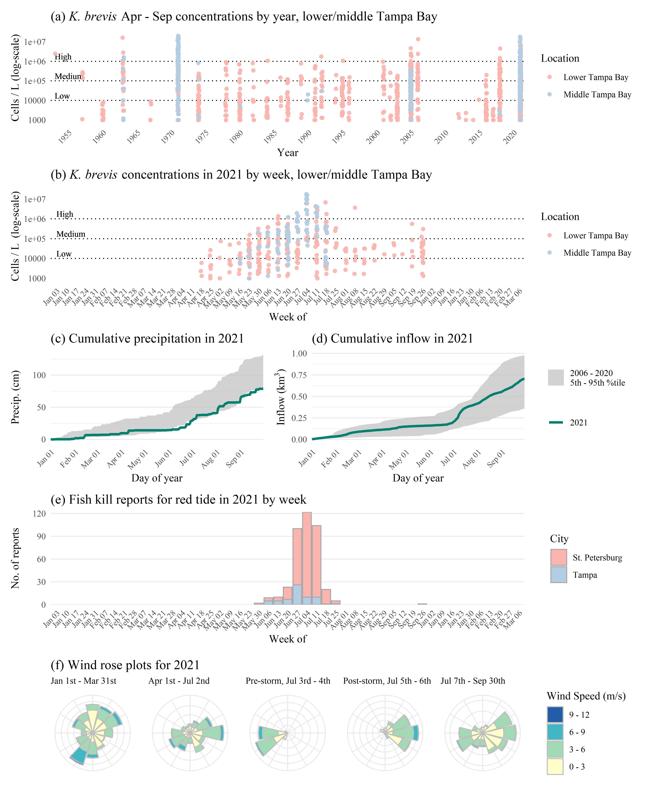

```{r setup, echo = F, warning = F, message = F, results = 'hide'}
# figure path, chunk options
knitr::opts_chunk$set(fig.path = 'figs/', warning = F, message = F, echo = F, cache = F, dev.args = list(family = 'serif'), dpi = 300, warning = F,
  fig.process = function(x) {
  x2 = sub('-\\d+([.][a-z]+)$', '\\1', x)
  if (file.rename(x, x2)) x2 else x
  })

library(here)

data(rstrnpts)
load(file = here('tables/wqsumtab.RData'))
load(file = here('tables/stktab.RData'))
load(file = here('tables/wqcmptab.RData'))
load(file = here('tables/savtab.RData'))
load(file = here('tables/mcrtab.RData'))

# # extract bib entries from online
# bib_scrp('manu_draft.Rmd', 'refs.bib')
```

`r paste('Last manuscript build', Sys.time())`

```{r echo = F, cache = F, eval = F}
spelling::spell_check_files('manu_draft.Rmd')
```

# Abstract

From March 30th to April 9th, 2021, 215 million gallons of legacy phosphate mining wastewater from the Piney Point facility were released into Tampa Bay (Florida, USA).  An estimated 205 tons of total nitrogen were exported to Lower Tampa Bay, exceeding typical annual nitrogen load estimates in a matter of days.  An initial phytoplankton response was observed in samples closest to the discharge site, with chlorophyll concentrations exceeding 50 ug/L. Macroalgae blooms of cyanobacteria (*Lyngbya* spp.) were observed in May, with biomass estimated at 0.5 kg/m2 at some locations.  Blooms of *Karenia brevis* were observed beginning in May and continuing through July.  Reported fish kills tracked bloom concentrations, prompting local cleanup efforts to remove over 1700 tons of dead fish.  Combined, these observations indicate abnormal conditions in Tampa Bay following release of wastewater from Piney Point, which is supported by comparison to the decades of baseline environmental monitoring data for the region. 

*Key words*: nitrogen, phosphate mining, Tampa Bay, wastewater, water quality

# Introduction

Ecosystem management paradigms for estuaries of the Gulf Coast of Florida, USA are based primarily on the control of nutrient pollutants from stormwater and wastewater sources.  The effects of nitrogen from source inputs are well understood as a limiting nutrient for the growth of algal blooms that can degrade water quality, having a negative effect on inter- and subtidal habitats [@Nixon95;@Howarth06;@Parker12;@Greening14]. Seagrasses in particular are a primary endpoint for assessing the impacts of nutrient pollution on water quality based on established relationships between nitrogen, phytoplankton growth, water clarity, and light requirements for seagrass species observed in nearshore environments [@Dixon95;@Kenworthy96;@Greening06;@Beck18g].  Tampa Bay is the largest estuary in Florida located in a heavily urbanized watershed of nearly 3 million individuals.  Historical gains in seagrass coverage in Tampa Bay have been achieved through public-private partnerships and consensus-based approaches to science applications that seek to limit the total nutrient loads into major bay segments [@Janicki96;@Greening16].  Together, these efforts have resulted in the long-term recovery of Tampa Bay through a reduction in nitrogen loads, improvements in water clarity, and baywide expansion of seagrass coverage to benchmark targets established for the region [@Greening14;@Sherwood17].    

Ongoing threats and challenges to protecting water quality of Gulf Coast estuaries persist despite historical gains in environmental recovery.  Although point-source inputs of nutrient loads from wastewater treatment plants into Tampa Bay have been reduced, non-point sources from wastewater and stormwater runoff contribute nutrients to the bay, particularly during the rainy season from June to September [@Janicki08;@Janicki17].  Atmospheric deposition of nutrients from coal-based power production and automobile traffic further contribute about one-quarter of the total nitrogen inputs to the bay [@Poor13].  Climate change stressors, such as sea level rise, changing rainfall patterns, and temperature alterations, may further perturb ecosystem dynamics and assimilative capacity by reducing system resilience to nutrient inputs [@Sherwood14;@Burke17].  Many of these challenges are addressed by ongoing efforts of the US EPA National Estuary Program to implement a science-based resource management plan for the Bay[@Ohara17].  The Tampa Bay Estuary Program has been instrumental in coordinating efforts among local and regional partners to address legacy pollutants and current threats to the long-term protection of bay resources [@Greening14;@Greening16]. 

Wastewater byproducts from mining are a global threat to the quality of surface and groundwater resources worldwide [@Tayibi09;@Hudson11]. Fertilizer is produced through the "wet process" reaction to create phosphoric acid by treating mined phosphate rock with sulfuric acid [@Burnett01;@Perez16].  The process generates large amounts of waste, creating approximately one unit of phosphoric acid per five units of waste precipitate, or phosphogypsum (CaSO$_4\cdot$ H$_2$O).  Impurities, contaminants, and radionuclides exist in phosphogypsum, making it commercially invaluable and the resulting waste is typically stored on-site in large earthen stacks (gypstacks) or holding ponds [@Burnett01].  The stacks are usually near distribution centers where fertilizer is shipped elsewhere, such as port facilities close to coastal resources or population centers [@Beck18]. There are obvious environmental and human health risks associated with these stacks, primarily through controlled or uncontrolled discharge to surface waters or groundwater contamination through leaching from unlined or poorly maintained stacks. Examples exist worldwide demonstrating the potential harm of these facilities on the environment [@Tayibi09;@Sanders13;@elzrelli15;@Perez16;@Beck18].   

The geology of central Florida is rich in phosphates that have supported a multi-billion dollar mining industry for fertilizer used in food production [@Henderson04].  By 2001, an estimated 40 million tons of phosphogypsum were created each year in northern and central Florida [@Burnett01].  Currently, seventeen phosphogypsum stacks (two active, five inactive, ten closed, [Florida Department of Environmental Protection](https://geodata.dep.state.fl.us/datasets/6277c3b1eeae4a818f8683fc29e6b35b_0/about)) exist in the Tampa Bay watershed with no long-term plan for closure or disposal of waste to prevent impacts to the environment.  The Piney Point facility located in Palmetto, Florida is a large phosphogypsum stack established in 2001 located less than two miles from the shore of Tampa Bay and near two aquatic preserves [@Henderson04].  Bankruptcy of the mining company responsible for the stack in 1999 transferred ownership to a third-party, with oversight by the Florida Departmental of Environmental Protection (FLDEP).  Decreasing holding capacity of the ponds with seasonal rain events and storage of dredging material from nearby Port Manatee have contributed to degradation of the facility.  Discharges of wastewater from the stacks occurred in 2010 to nearby Bishops Harbor connected to Tampa Bay [@Garrett11].  Recently, FLDEP authorized an [emergency order](https://floridadep.gov/sites/default/files/21-0323.pdf) on March 30th, 2021 to release wastewater from the stacks directly into lower Tampa Bay to prevent catastrophic failure of the berms supporting the holding ponds.   
  
This paper provides an initial assessment of environmental conditions in Tampa Bay over five months following the recent release of 215 million gallons of legacy phosphate mining wastewater in April, 2021.  The goal is to describe the results of monitoring data of surface waters collected in response to the discharge event to assess deviation of current conditions relative to long-term, seasonal records of water quality, phytoplankton, seagrass, benthic, and nekton datasets available for the region.  We provide a brief overview of the history of the Piney Point facility, including past wastewater releases and impacts observed in Tampa Bay.  A timeline of events in 2021 is also provided, which is supported by the results from 2021 response-based monitoring of conditions in and around Piney Point.  The results of this study provide an initial documentation of impacts to the natural resources of Tampa Bay that can be used to inform long-term assessments of acute wastewater discharge events on the environmental quality of the region.  We focus primarily on the perspective of the Tampa Bay Estuary Program in its role in coordinating monitoring and evaluating short-term impacts, particularly in the context of long-term management goals that leverage resources from existing partnerships among local resource management institutions. 

# Methods

* Historical timeline: https://docs.google.com/document/d/1KqaEAYEG7pdcGpWbUjONfVKMHHB6_kOkKCyncp4JYKA/edit, https://thebradentontimes.com/piney-point-a-retrospective-p6328-158.htm
* Initial response, data collection
* Synthesis and Analysis

Need to note that K. brevis cell data are from event-based sampling, i.e., not appropriate to combine with other data for stats analysis.

All stats based on FLDEP monitoring, fixed sample design, etc.

For total nitrogen, chlorophyll-a, and secchi depth, differences in concentrations between months within each area (Figure \@ref(fig:map)a) were evaluated using a Kruskal-Wallis one-way analysis of variance (ANOVA) followed by multiple comparisons using 2-sided Mann-Whitney U tests [@Hollander13]. Probability values were adjusted using the sequential Bonferroni method described in [@Holm79] to account for the increased probability of Type I error rates with multiple comparisons. An adjusted p-value < 5\% ($\alpha$ = 0.05) was considered a significant difference between months.

# Results

* Figure \@ref(fig:map) map
* Figure \@ref(fig:timeline) timeline of events
* Figure \@ref(fig:wqmap) map of water quality observations
* Figure \@ref(fig:wqtrnds) boxplots by week with +/-1sd for monthly long-term
* Figure \@ref(fig:pcacors) pca and correlations of all wq variables, by area 
* Figure \@ref(fig:trnex) seagrass and macroalgae example transect
* Figure \@ref(fig:trnfrq) seagrass, macroalgae frequency occurrence estimates
* Figure \@ref(fig:allpcacors) seagrass, macralgae, wq pca and correlation matrix
* Figure \@ref(fig:redtide) red tide historic and current, fish kill reports historic and current

* Table \@ref(tab:stktab) Stack characteristics
* Table \@ref(tab:wqsumtab) water quality data collected and summarized
* Table \@ref(tab:wqcmptab) Multiple comparisons of water quality by month/area, with median/min/max
* Table \@ref(tab:mcrtab) Macroalgae freq. occurrence summaries by month/area, with median/min/max
* Table \@ref(tab:savtab) Seagrass freq. occurrence summaries by month/area, with median/min/max

Seagrass: note decline of HW and correlations in the matrix, these make sense. 

Seagrass interp from DT: 

First off, Marcus please correct me if any confusion on my part about how to read the chart, but it’s my take that the asterisks reflect levels of significance, and that a box without an asterisk – I didn’t pay much attention to that.  Also, a negative number would be a “cool” color, reflecting an inverse relationship, while a positive number (warm color) would reflect a positive correlation?

If I have this correct, then what stood out to me was some of the following – seagrass distributions are highly inversely correlated between most of the species, which reflects seagrass being clonal organisms that tend not to grow interspersed with each other in a random manner.  S. filiforme does not grow in shallow waters, because it’s blades can’t “lay down” during low tides, and it often is the deepest growing species in some of our cleaner areas, while H. wrightii can be both the shallowest and deepest growing species in areas like Hillsborough Bay.

More relevant here is that there is no significant correlation between the abundance of cyanobacteria and either chlorophyll-a or TN or TP.  To me, that makes sense, since macroalgae like cyanos seem to reflect an alternative nutrient destination, compared to phytoplankton.  The strongest correlations out there are the well expected ones between TN and Chl-a, but also between TP and NH3/4, which suggests overall nutrient availability tracks together, and phytoplankton continue to be a major destination of nitrogen availability.

But what about the positive correlation between cyanobacteria and S. filiforme?  From my experience in Sarasota Bay, that makes sense, since the highest levels of cyanobacteria were found entangled within the manatee grass meadows in the fairly deeper waters farther offshore.  Cyanos are strongly negatively correlated with red algae, since they occurred at different times, basically.

Finally, keep in mind that “Lyngbya” life cycles are such that most of the biomass produced does not stay where it was produced.  Those clumps of Lyngbya growing on the bottom get lifted up off the bottom by the oxygen bubbles you can see in their blooms, and they then are carried along the shoreline to decompose on whatever shoreline that they’ve been blown to.  Our photos (and others) clearly show that there is MUCH more Lyngbya in our bays than what we’ve sampled along the bottom of the bay – that’s a bit different than “traditional” red algae biomass.

# Discussion

* Comparison to other locations/past events - Grand Bay, Bishop Harbor, Huelva estuary [@Perez10;@Perez16], Dillon report about Grand Bay [link](https://www.wrri.msstate.edu/pdf/2016dillon_finalreport.pdf)
* Analysis limitations: no smoking gun but 2021 is an anomaly, additional info (benthic diversity TBD, nekton diversity TBD, large mammals, etc.), response-based monitoring may be biased
* Potential long-term impacts TBD
* Current challenges in TB/southwest FL - OTB, seagrass loss (possibly linked to 2018 red tide, effects of Hurricanes [@Tomasko20]), red tide, climate change
* Risk of decline (IRL ex.), regression of past progress

# Acknowledgments

# Figures

```{r map, fig.cap = 'Areas of interest (a) for evaluating status and trends in response-based monitoring data and sample locations from March to July 2021 by monitoring data type (b) in response to wastewater discharge from Piney Point.  Data types include algae sampling, seagrass and macroalgae, water quality (field-based and laboratory samples), and mixed monitoring (algae, seagrass and macroalgae, water quality).  Inset shows location of Tampa Bay on the Gulf coast of Florida, USA.'}
knitr::include_graphics(here('figs/map.jpeg'))
```

```{r timeline, fig.cap = 'Graphical timeline of events from the discharge of wastewater effluent at Piney Point starting Mrach 30th, 2021 through the end of July with the gradual decline of red tide in Tampa Bay.'}
knitr::include_graphics(here('figs/timeline.jpeg'))
```

```{r wqmap, fig.cap = 'Sampled water quality data for April to July 2021 in response to wastewater discarge from Piney Point for (a) total nitrogen (mg/L), (b) chlorophyll-a (ug/L), and (c) secchi disk depth (meters).  Values outside of the normal range (above for total nitrogen and chlorophyll, below for secchi) are outlined in black and those in normal range are outlined in light grey.  Color ramps and point sizes show relative values (reversed for Secchi).  Normal ranges are defined as within +/-1 standard deviation of the mean for the month of observation from 2006 to 2021 for values collected at the nearest long-term monitoring site to each sample location.  Chlorophyll observations were truncated to a maximum of 30 ug/L to remove some outliers.'}
knitr::include_graphics(here('figs/wqmap.jpeg'))
```

```{r wqtrnds, fig.cap = 'Sampled water quality data by week for April to July 2021 in response to wastewater discarge from Piney Point for (a) total nitrogen (mg/L), (b) chlorophyll-a (ug/L), and (c) secchi disk depth (meters).  Observations are aggregated by week and within assessment areas shown in Figure \\@ref(fig:map)a.  Normal ranges for the month of observation (monthly baseline) and area are shown by the blue shaded areas. Normal ranges are defined as within +/-1 standard deviation of the mean for the month of observation from 2006 to 2021 for values collected at long-term monitoring sites within each area.'}
knitr::include_graphics(here('figs/wqtrnds.jpeg'))
```

```{r pcacors, fig.cap = 'Principal components analyses (PCA) and correlation matrices for water quality variables by week for April to July 2021 in response to wastewater discharge from Piney Point for (a) area 1, (b) area 2, and (c) area 3 (Figure \\@ref(fig:map)a).  All variables were standardized to zero mean and unit variance prior to PCA. Variables with log-normal distribution were log-transformed prior to analysis.  Pearson correlations indicate the linear strength of assocation between pairs of variables. ** p < 0.005, * p < 0.05, blank is not signifcant at $\\alpha$ = 0.05.'}
knitr::include_graphics(here('figs/pcacors.jpeg'))
```

```{r trnex, fig.cap = 'Results for (a) seagrass and (b) macroalgae rapid response transect surveys at a site (S3T6, -82.55866 W longitude, 27.64483 N latitude) near Piney Point.  Sample dates in 2021 are shown in rows with transect meter results shown in columns. Results show dominance of manatee grass (*Syringodium filiforme*) and red macroalgae groups, with abundances of *Lyngbya sp.* (cyanobacteria) peaking in June and green macroalgae (*Ulva sp.*) increasing in July.  Abundances are Braun-Blanquet coverage estimates.'}
knitr::include_graphics(here('figs/trnex.jpeg'))
```

```{r trnfrq, fig.cap = 'Frquency occurrence estimates for (a) area 1 and (b) area 2 (Figure \\@ref(fig:map)a) for seagrass (top) and macroalgae (bottom) rapid response transect surveys across all transects (n = `r nrow(rstrnpts)`) near Piney Point.  Estimates are grouped by sample months in 2021. Frequency occurrences are absolute for each taxa based on presence/absence.'}
knitr::include_graphics(here('figs/trnfrq.jpeg'))
```

```{r allpcacors, fig.cap = 'Principal components analysis (PCA) and correlation matrix for water quality variables, macroalgae, and seagrasses by week for April to July 2021 in response to wastewater discharge from Piney Point.  Only areas 1 and 3 (Figure \\@ref(fig:map)a) are included where seagrass transects were surveyed. All variables were standardized to zero mean and unit variance prior to PCA. Variables with log-normal distribution were log-transformed prior to analysis.  Thick black lines in the correlation matrix separate water quality, macroalgae, and seagrass variables. Pearson correlations indicate the linear strength of assocation between pairs of variables. ** p < 0.005, * p < 0.05, blank is not significant at $\\alpha$ = 0.05.'}
knitr::include_graphics(here('figs/allpcacors.jpeg'))
```

```{r redtide, fig.cap = '*Karenia brevis* concentrations (100k cells/L) and number of fish kill reports for the contiguous record showing cell concentrations (a) by year and (b) by week in 2021 and reported fish kills by city (Tampa, St. Petersburg) (c) by year and (d) by week in 2021. Red tide concentrations show minimum, tenth percentile, median, 90th percentile, and maximum for each year or week for middle and lower Tampa Bay. *K. brevis* cell counts are from NOAA Harmful Algal BloomS Observing System (HABSOS, https://www.ncei.noaa.gov/maps/habsos), Fish kill reports are from Florida Fish and Wildlife Conservation Commission, Fish and Wildlife Research Insitute Fish Kill Database, attributed to *K. brevis* (https://public.myfwc.com/FWRI/FishKillReport/).'}

```

# Tables

```{r stktab}
cap.val <- 'Measured concentrations from the phosphogypsum stack (NGS-S) at Piney Point on April 9th, 2021 for relevant water quality variables compared to normal annual means (min, max) for concentrations in lower Tampa Bay.  Normal medians are based on data for a baseline period from 2006 to 2020 from long-term monitoring stations in lower Tampa Bay collected monthly by Hillsborough County Environmental Protection Commission.'
knitr::kable(stktab, booktabs = T, caption = cap.val)
```

```{r wqsumtab}
cap.val <- 'Summary of water quality variables collected from March to July 2021 in response to wastewater discharge from Piney Point. Variables are grouped by major areas interest for evaluating status and trends shown in Figure \\@ref(fig:map)a. Summaries are median, maximum, and minimum values. Total observations (N obs.) and values in rnage, above, or below normal ranges are also shown. Normal ranges are defined as within +/-1 standard deviation of the mean for the month of observation from 2006 to 2021 for values collected at the nearest long-term monitoring site to each sample location.'
knitr::kable(wqsumtab, booktabs = T, caption = cap.val)
```

```{r wqcmps}
cap.val <- 'Comparison of total nitrogen, chlorophyll-a, and secchi depth by areas of interest (Figure \\@ref(fig:map)a) and month.  Overall signifance of differences of concentrations between months for each water quality variable and area combination are shown with Chi-squared statistics based on Kruskall-Wallis rank sum tests.  Multiple comparisons with Mann-Whitney U tests (Comp column) were used to evaluate pairwise monthly concentrations for each water quality variable in each area.  Rows that share a letter within each area and water quality variable combination have concentrations that are not significantly different. Probability values were adjusted for the pairwise comparisons using the Bonferroni method in @Holm79. ** p < 0.005, * p < 0.05, blank is not signifcant at $\\alpha$ = 0.05.'
knitr::kable(wqcmptab, booktabs = T, caption = cap.val)
```

```{r mcrtab}
cap.val <- 'Comparison of macroalgae frequency occurrence by areas of interest (Figure \\@ref(fig:map)a) and month.  Overall signifance of differences of frequency occurrence between months for macroalgae groups and area combination are shown with Chi-squared statistics based on Kruskall-Wallis rank sum tests.  Multiple comparisons with Mann-Whitney U tests (Comp column) were used to evaluate pairwise monthly frequency occurrences for each macroalgae group in each area.  Rows that share a letter within each area and macroalgae group combination have frequency occurrences that are not significantly different. Probability values were adjusted for the pairwise comparisons using the Bonferroni method in @Holm79. ** p < 0.005, * p < 0.05, blank is not signifcant at $\\alpha$ = 0.05.'
knitr::kable(mcrtab, booktabs = T, caption = cap.val)
```

```{r savtab}
cap.val <- 'Comparison of seagrass species frequency occurrence by areas of interest (Figure \\@ref(fig:map)a) and month.  Overall signifance of differences of frequency occurrence between months for seagrass species and area combination are shown with Chi-squared statistics based on Kruskall-Wallis rank sum tests.  Multiple comparisons with Mann-Whitney U tests (Comp column) were used to evaluate pairwise monthly frequency occurrences for each seagrass species in each area.  Rows that share a letter within each area and seagrass species combination have frequency occurrences that are not significantly different. Probability values were adjusted for the pairwise comparisons using the Bonferroni method in @Holm79. ** p < 0.005, * p < 0.05, blank is not signifcant at $\\alpha$ = 0.05.'
knitr::kable(savtab, booktabs = T, caption = cap.val)
```

# References