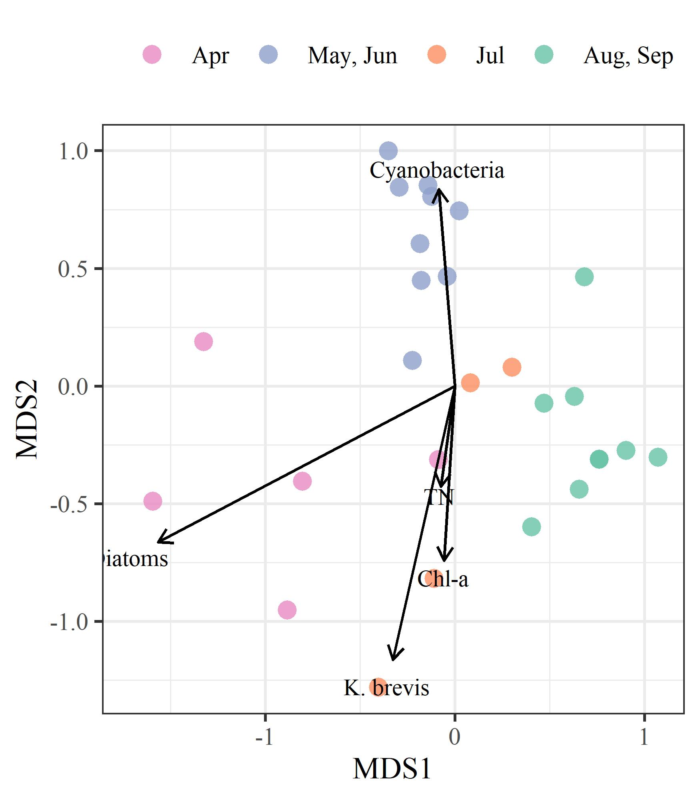

```{r setup, echo = F, warning = F, message = F, results = 'hide'}
# figure path, chunk options
knitr::opts_chunk$set(fig.path = 'figs/', warning = F, message = F, echo = F, cache = F, dev.args = list(family = 'serif'), dpi = 300, warning = F,
  fig.process = function(x) {
  x2 = sub('-\\d+([.][a-z]+)$', '\\1', x)
  if (file.rename(x, x2)) x2 else x
  })

box::use(
  here[here],
  dplyr[...],
  tidyr[fill],
  english[english], 
  lubridate[month,year,mdy,floor_date], 
  tibble[deframe]
)

data(rswqdat)
data(rstrnpts)
data(rstrndat)
data(trnsum)

load(file = here('tables/wqsumtab.RData'))
load(file = here('tables/stktab.RData'))
load(file = here('tables/wqcmptab.RData'))

maxdt <- as.Date('2021-10-01')

# # extract bib entries from online
# bib_scrp('manu_draft.Rmd', 'refs.bib')
```

`r paste('Last manuscript build', Sys.time())`

```{r echo = F, cache = F, eval = F}
spelling::spell_check_files('manu_draft.Rmd')
```

# Abstract

From March 30th to April 9th, 2021, 215 million gallons of legacy phosphate mining wastewater from the Piney Point facility were released into Tampa Bay (Florida, USA).  An estimated 205 tons of total nitrogen were exported to Lower Tampa Bay, exceeding typical annual external nitrogen load estimates in a matter of days.  An immediate phytoplankton response (non-harmful diatom) was observed in samples closest to the discharge site, with chlorophyll concentrations exceeding 50 ug/L. Cyanobacteria blooms (*Dapis* spp.) were observed beginning in May, with biomass peaking in June at 48% frequency occurrence for some locations.  Blooms of *Karenia brevis* were first observed in May and continued through July within Tampa Bay proper.  Reported fish kills tracked bloom concentrations, prompting local cleanup efforts to remove over 1800 tons of dead fish.  Combined, these observations indicate abnormal conditions in Tampa Bay following release of wastewater from Piney Point, which is supported by comparison to the decades of baseline environmental monitoring data for the region and typical seasonal conditions experienced in recent years. 

*Key words*: algae, nitrogen, phosphate mining, seagrass, Tampa Bay, wastewater, water quality

# Introduction

Ecosystem management paradigms for estuaries of the Gulf Coast of Florida, USA are based primarily on the control of nutrient pollutants from atmospheric, stormwater and wastewater sources.  The effects of nitrogen from dominant external source inputs are well understood as a limiting nutrient for the growth of algal blooms that can degrade water quality, having a negative effect on inter- and subtidal habitats [@Nixon95;@Howarth06;@Parker12;@Greening14]. Seagrasses in particular are a primary endpoint for assessing the impacts of nutrient pollution on water quality based on established relationships between nitrogen, phytoplankton growth, water clarity, and light requirements for seagrass species observed in nearshore environments [@Dixon95;@Kenworthy96;@Greening06;@Beck18a].  Tampa Bay is the largest open-water estuary in Florida, located in a heavily urbanized watershed of nearly 3.1 million individuals.  Historical gains in seagrass coverage in Tampa Bay have been achieved through public-private partnerships and consensus-based approaches to science applications that seek to limit the total nutrient loads delivered to major bay segments [@Janicki96;@Greening16].  Together, these efforts have resulted in the long-term recovery of Tampa Bay through a reduction in external nitrogen loads, improvements in water clarity, and baywide expansion of seagrass coverage to benchmark targets established for the region [@Greening14;@Sherwood17].    

Ongoing threats and challenges to protecting water quality of Gulf Coast estuaries persist despite recent environmental recovery.  Because point-source inputs of nutrient loads from wastewater treatment plants and industrial sources into Tampa Bay have been greatly reduced, non-point source loads from wastewater sources and stormwater runoff are now estimated to dominate external nutrient loads to the bay, particularly during the rainy season from June to September [@Janicki08;@Janicki17].  Atmospheric deposition of nutrients from fossil fuel-based power production and automobile traffic further contribute about one-quarter of the total nitrogen inputs directly to the bay's surface [@Poor13]. Climate change stressors, such as sea level rise, changing rainfall patterns, and temperature alterations, may further perturb ecosystem dynamics and assimilative capacity by reducing system resilience to nutrient inputs [@Sherwood14;@Burke17]. The Tampa Bay Estuary Program and its partners have been instrumental in coordinating efforts among local and regional stakeholders to address legacy pollutants and current threats to the long-term protection of bay resources through implementation of a science-based resource management plan for the Bay [@Greening14;@Greening16]. 

Wastewater byproducts from mining are a global threat to the quality of surface and groundwater resources [@Tayibi09;@Hudson11]. Phosphate fertilizer is produced through the "wet process" reaction to create phosphoric acid by treating mined phosphate rock with sulfuric acid [@Burnett01;@Perez16].  The process generates large amounts of waste, creating approximately one unit of phosphoric acid per five units of waste precipitate, or phosphogypsum (CaSO$_4\cdot$ H$_2$O). Impurities, contaminants, and radionuclides exist in phosphogypsum, making it commercially invaluable and the resulting waste is typically stored on-site in large earthen stacks (gypstacks) or holding ponds [@Burnett01].  The stacks are usually near distribution centers where fertilizer is shipped elsewhere, such as port facilities close to coastal resources or population centers [@Beck18b]. There are obvious environmental and human health risks associated with these stacks, primarily through controlled or uncontrolled discharge to surface waters or groundwater contamination through leaching from unlined or poorly maintained stacks. Examples exist worldwide demonstrating the potential harm of these facilities on the environment [@Tayibi09;@Sanders13;@elzrelli15;@Perez16;@Beck18b].   

The geology of central Florida is rich in phosphates that have supported a multi-billion dollar mining industry for fertilizer used in food production [@Henderson04].  By 2001, an estimated 40 million tons of phosphogypsum were created each year in northern and central Florida [@Burnett01].  Currently, seventeen phosphogypsum stacks (two active, five inactive, ten closed, [Florida Department of Environmental Protection](https://geodata.dep.state.fl.us/datasets/6277c3b1eeae4a818f8683fc29e6b35b_0/about)) exist in the Tampa Bay watershed with no comprehensive, long-term plan for closure or disposal of waste.  The Piney Point facility located in Palmetto, Florida is a large, remnant phosphogypsum stack with three holding ponds located less than two miles from the shore of Tampa Bay and near two Florida Aquatic Preserves [@Henderson04].  Bankruptcy of the mining company responsible for the stack in 1999 transferred ownership to a third-party, HRK Holdings, LLC (hereafter HRK), with oversight by the Florida Departmental of Environmental Protection (FDEP).  Decreasing holding capacity of the ponds from seasonal rain events, tropical storms, and storage of dredging material from nearby Port Manatee have contributed to degradation of the facility.  Discharges of wastewater from the stacks occurred in the early 2000s and 2011 to nearby Bishop Harbor connected to Tampa Bay.  Those discharges resulted in spatially-restricted, ecosystem responses [@Switzer11;@Garrett11]. 

Recently, HRK suspected leakages from a tear in the plastic liner of the southern holding pond (NGS-S) when water quality samples with a similar conductivity as the wastewater were detected at onsite seepage interceptor drains.  In response, FDEP authorized an [emergency order](https://floridadep.gov/sites/default/files/21-0323.pdf) on March 30th, 2021 to release wastewater from the southern gypstack directly into lower Tampa Bay to prevent catastrophic failure of the berms supporting the holding ponds. At that time, approximately 480 million gallons of mix legacy phosphate mining wastewater and seawater from port dedging operations was being held in the failing gypstack.  Water quality parameters of NGS-S measured in 2019 were well above baseline conditions typical of surface waters in Tampa Bay (Table \@ref(tab:stktab)), particularly for total phosphorus (160 mg/L) and total nitrogen (230 mg/L). Due to public safety and property concerns over catastrophic failure of the holding walls, an [emergency order](https://floridadep.gov/sites/default/files/21-0323.pdf) was issued by FDEP on March 29th for HRK to begin release of wastewater from the stack into Tampa Bay to reduce physical strain on the stacks.  Unlike past discharges from the site, HRK was authorized to release untreated wastewater through siphon lines established during dredging operations in 2011 and that discharged through Berth 12 at Port Manatee.  This was done under the assumption that backwater habitats (e.g., Bishop Harbor) may be spared the impacts of additional effluent discharges from the site, as was observed in prior events.  From March 30th to April 9th, approximately 215 million gallons of wastewater were released to lower Tampa Bay.  Over this ten day period, an estimated 205 tons of nitrogen were delivered to the bay, exceeding contemporary annual estimates of external nutrient loads to lower Tampa Bay in a matter of days [@tbep0417].    
  
This paper provides an initial assessment of environmental conditions in Tampa Bay over four months following the recent release of legacy phosphate mining wastewater in April, 2021.  The goal is to describe the results of monitoring data of surface waters collected in response to the discharge event to assess relative deviation of current conditions from long-term, seasonal records of water quality, phytoplankton, and seagrass/macroalgae datasets available for the region.  We provide a brief overview of the history of the Piney Point facility, including past wastewater releases and impacts observed in Tampa Bay.  A timeline of events in 2021 is also provided, which is supported by the quantitative results from 2021 response-based monitoring of conditions in and around Port Manatee, FL -- the focal point of emergency discharges from the Piney Point facility.  The results of this study provide an initial documentation of impacts to the natural resources of Tampa Bay that can be used to inform long-term assessments of acute wastewater discharge events on the environmental quality of the region as well as a potential template for future emergency responses.  We focus primarily on the perspective of the Tampa Bay Estuary Program in its role in coordinating monitoring and evaluating short-term impacts, particularly in the context of seagrass resources and long-term management goals that leverage existing partnerships among local resource management institutions. 

# Methods    

## History of Piney Point 

The Piney Point facility in Palmetto, Florida was established in 1966 by the now defunct Borden Chemicals company near Port Manatee on the southeast shore of lower Tampa Bay. Port operations were primarily for export of phosphate production by the plant.  Numerous environmental issues were observed in these early years, including suspected wastewater contamination in nearby Bishop Harbor, groundwater contamination from industrial solvents, and air pollution from plant emissions [@Henderson04].  Ownership of the facility was transferred to different companies over the course of operation and in 1993 the plant was acquired by Mulberry Phosphates, Inc., which also owned a mining facility in Mulberry, Florida to the north.  In 1997, 54 million gallons of phosphate mining process water from the Mulberry plant spilled into the Alafia River, the second largest tributary to Tampa Bay, killing 1.3 million fishes and impacting 153 hectares of wetland habitat. 

The Mulberry corporation filed for bankruptcy in 2001, transferring regulatory oversight of the Piney Point facility to FDEP.  Although phosphate production no longer occurred at the site, focus over the next twenty years centered on containment and treatment of wastewater on-site to minimize environmental impacts.  Despite these efforts, reduced holding capacities and degraded physical integrity of the holding ponds likely contributed to discharge events to surficial and ground waters.  Tropical storm Gabrielle in 2001 produced 13 inches of rain, causing over 10 million gallons of wastewater to be released into Bishop Harbor, with an estimated 15.4 tons of nitrogen (pers. comm. D. Eckenrod to USEPA, Nov. 28, 2001).  Species of phytoplankton associated with harmful algal blooms were observed around this time [@Garrett11]. From November 2003 to October 2004, treated process water from Piney Point was discharged to Bishop Harbor to further reduce the likelihood of an uncontrolled spill. @Switzer11 reported minimal impacts to nekton communities, although macroalgal blooms of *Ulva spp.* and *Gracilaria spp.* were observed as a potential indication of nutrient eutrophication. Around the same time, 248 million gallons of wastewater from Piney Point were barged 120 miles offshore to the Gulf of Mexico to reduce strain on the holding capacity of storage ponds [@Hu03].  Efforts for onsite treatment were also increased during this period to increase pH, remove heavy metals, and reduce nutrient concentrations to minimize impacts of discharge to local areas. 

HRK acquired Piney Point in August 2006 through an administrative agreement with FDEP.  This agreement transferred responsibility of the site to HRK with the intention that any future uses must protect and be compatible with the integrity of stack closure and long-term care.  In 2011, HRK agreed to the storage of 1.5 million cubic yards of dredged material and seawater from Port Manatee to improve shipping capacity at the port (i.e., Berth 12 construction).  This material was added to an existing gypstack at Piney Point. Placement of the dredged material was suspected in compromising the liner integrity which led to an emergency discharge that released 169 million gallons of dredged saltwater slurry and 3.5 tons of nitrogen to receiving waters leading to Bishop Harbor. The dredging and deposit of slurry at Piney Point continued following structural fortifications to the holding stacks to ensure integrity with additional loadings.  HRK maintains ownership and responsibility of the site to present day with oversight by FDEP.

## Monitoring response to the emergency discharge

Monitoring of the natural resources of Tampa Bay in response to the wastewater release at Piney Point began in April, 2021 and continued over the following months. These data were collected through a coordinated effort, facilitated in part by the FDEP and TBEP.  Monitoring agencies and local partners that collected data included FDEP, Environmental Protection Commission (EPC) of Hillsborough County, Parks and Natural Resources Department of Manatee County, Pinellas County Division of Environmental Management, Fish and Wildlife Research Institute of the Florida Fish and Wildlife Conservation Commission (FWC), City of St. Petersburg, TBEP, Sarasota Bay Estuary Program, Environmental Science Associates, University of South Florida, University of Florida, and New College of Florida. Monitoring efforts focused on a suite of parameters expected to respond to increased nutrient loads into the bay, including water quality sampling (laboratory processing of discrete samples and *in situ* measurements), phytoplankton cell counts, and seagrass and macroalgae transect surveys (Figure \@ref(fig:map)).  Additional sampling for contaminants (e.g., heavy metals), invertebrates, and nekton was also conducted, but they are not reported here in anticipation of future monitoring events.  

Established laboratory and field sample protocols for all survey methods were based on an [Interagency Monitoring Project Plan](https://drive.google.com/drive/u/0/folders/1oBGvjdve-Gpo4Kn3Ovn8a8-yVoP25eec) maintained by the TBEP in agreement with USEPA standards and those of the inter-agency partners.  To the extent possible, data quality objectives followed guidelines outlined in the TBEP Data Quality Management Plan [@tbep1620]. Many of the local partners also participate in the Southwest Florida [Regional Ambient Monitoring Program](https://tbep.org/our-work/boards-committees/technical-advisory-committee/#ramp) that ensures similar standards and protocols are followed in the collection of monitoring data, including routine cross-reference of samples between laboratories to check precision of measured values.  Discrete water quality samples were taken primarily from surface grabs by boat and processed by the respective laboratories of each participating agency.  For this paper, we focus on parameters related to the Tampa Bay nutrient management paradigm and the expected phytoplankton response from a dense, inorganic nitrogen plume entering the bay.  This included evaluation of total nitrogen (mg/L), total ammonia nitrogen (NH$_3$ + NH$_4^+$, mg/L), nitrate/nitrite (NO$_3^-$ + NO$_2^-$, mg/L), total phosphorus (mg/L), orthophosphate (PO$_4^{3-}$, mg/L), and chlorophyll-a (ug/L) concentrations.  Samples for pH, salinity (psu), temperature (^o C), and dissolved oxygen saturation (\%) were also evaluated given the role these parameters can have as indicators of wastewater contamination (pH), physical drivers of primary production (salinity, temperature), and indicators of primary production and respiration (dissolved oxygen, mg/L).  Overall, sample effort was variable given agency resources at the time of the discharge event and over the next few months.  As appropriate, water quality data were aggregated at the weekly scale and by major areas of interest (Figure \@ref(fig:map)a) given the hypothesized impacts adjacent to the discharge site.  These areas of interest were delineated based on proximity to Piney Point, the main shipping channel in the bay, inflow boundaries (e.g., Little Manatee River), location of the Skyway Bridge at the mouth of Tampa Bay, and major segments of Tampa Bay used by TBEP for assessing programmatic goals.  

Phytoplankton samples were also collected by multiple partners and included a mix of quantitative samples enumerating major taxa by cell concentrations and qualitative presence/absence samples.  Taxa were aggregated into major groups of interest for Tampa Bay, with a focus on diatoms (Bacillariophyta and other centric taxa), as common primary producers observed throughout the growing season, and species associated with harmful algal blooms (HABs), as a potentially adverse outcome of these species outcompeting others in response to nutrient inputs from Piney Point.  Evaluation of HABs data included specific focus on the red tide organism *Karenia brevis* that can occur in the bay depending on salinity and temperature conditions during the growing season. Occurrence of this species has historically been spatially distinct, with blooms originating in the Gulf of Mexico and occasionally occurring at bloom concentrations in lower Tampa Bay.  Data for *K. brevis* were also obtained from event-based monitoring samples collected by FWC and available from the Harmful Algal BloomS Observing System ([HABSOS](https://habsos.noaa.gov/)).  Because of the increased occurrence of red tide in July following the emergency discharge, fish kill reports from FWC were also evaluated in relation to key municipalities (Tampa, St. Petersberg) impacted by the event. Fish kill reports were obtained from the FWC [online database](https://public.myfwc.com/fwri/FishKillReport/searchresults.aspx). 

Seagrass and macroalgae transect samples were collected approximately biweekly at locations around Piney Point from April to early October 2021.  Each year, the TBEP coordinates inter-agency sampling among regional partners at over sixty fixed locations throughout the bay [@Sherwood17]. Because of the time-sensitive nature of the potential impacts of wastewater on seagrasses near Piney Point, the sampling protocol used at the routine monitoring locations was modified as a "rapid survey" design to sample seagrasses and macroalgae along fifty meter transects at several of the long-term monitoring sites, as well as new locations selected along the shore and small subembayments (e.g., Bishop Harbor) to provide a more comprehensive coverage of the seagrass community near Piney Point.  Seagrasses and macroalgae were identified and abundances were estimated using Braun-Blanquet cover-abundance estimates within a 0.25 m$^2$ quadrat at 10m distances along each transect.  Dominant seagrass species in the bay include *Halodule wrightii*, *Syringodium filiforme*, and *Thalassia testudinum*.  Other seagrass species (i.e., *Halophila spp.*, *Ruppia maritima*) were also observed but were present at much lower abundances and were not evaluated herein.  Macroalgae taxa were aggregated by major group (i.e., red, green, and cyanobacteria) based on expected responses to nutrient pollution.  Seagrasses and macroalgae abundances were converted to frequency of occurrence estimates (i.e., number of locations present divided by total locations sampled) at the transect scale or within major areas (Figure \@ref(fig:map)a) depending on the analysis described below.  

## Data Analysis

```{r}
seconb <- rswqdat %>% 
  filter(date < maxdt) %>% 
  filter(var == 'secchi') %>% 
  filter(source == 'fldep') %>% 
  pull(qual) %>% 
  grepl('S', .)
sumb <- sum(seconb)
totb <- length(seconb) 
```

Long-term water quality monitoring data from Hillsborough and Manatee counties (accessible at https://wateratlas.usf.edu/) were used to establish baseline conditions for the major areas of interest in Figure \@ref(fig:map)a to compare with the response monitoring data described above. Observations at each monitoring station were averaged for each month across years from 2006 to 2020. This period represents a "recovery" stage for Tampa Bay where water quality conditions were much improved from historical conditions during a more eutrophic period and when seagrass areal coverage was trending towards and above a 1950s benchmark target of 38,000 acres [@Greening14;@Sherwood17].  For each month, the mean values +/- 1 standard deviation for each parameter at each station were quantified and used as reference values relative to results at the closest monitoring station that was sampled in response to Piney Point. This comparison was made to ensure that the response data were evaluated relative to stations that were spatially relevant (e.g., long-term conditions in Terra Ceia Bay are not the same as those in middle Tampa Bay) and seasonally-specific (e.g., historical conditions in April are not the same as historical conditions in July). In some cases, the nearest long-term station did not include data for every monitoring parameter at a response location and the next closest station was used as a reference.

The historical monitoring data were also used to model an expected seasonal pattern for water quality parameters from April to October in 2021.  This was done by estimating smoothed splines using Generalized Additive Models (GAMs) using data only from the "recovery" stage of Tampa Bay (2006 to 2020).  GAMs were used to model time series of water quality parameters as a function of a continuous value for year (i.e., decimal year) and as an integer value for day of year. The continuous year value was modeled with a thin plate regression spline and the day of year value was modelled with a cyclic spline [following similar methods @Murphy19].  The modeled results provided an estimate of the expected normal seasonal variation that takes into account a long-term annual trend.  Differences in the observed values sampled in the April to October time periods from the "forecasted" predictions of the baseline GAMs through 2021 provided an assessment of how the current data may have deviated from historical and normal seasonal variation. 

Statistical assessments were evaluated only on total nitrogen, chlorophyll-a, and secchi disk depth as a general analysis of potential patterns in eutrophication in nitrogen-limited systems. Observations for each data type were typically aggregated to the weekly or monthly scale given that sampling occurred at different days over the five month period.  Spatial comparisons were based primarily on the areas identified in Figure \@ref(fig:map)a. Variables with log-normal distribution were log$_10$-transformed (i.e., nutrients, chlorophyll) prior to analysis.  For statistical tests using water quality data, only the monitoring results from FDEP were used for analysis given the consistency of sample location and collection date compared to the remainder of the data obtained from other partners. Secchi observations that were visually identified on the bottom (`r sumb` observations of `r totb` in the FDEP data) were removed from analysis because these are right-censored data, whereas all other non-detects were left-censored and evaluated with methods described below. 

Differences in observations between months for water quality, seagrass, and macroalgae within each area (Figure \@ref(fig:map)a) were evaluated using a Kruskal-Wallis one-way analysis of variance (ANOVA) followed by multiple comparisons using 2-sided Mann-Whitney U tests [@Hollander13]. Probability values were adjusted using the sequential Bonferroni method described in [@Holm79] to account for the increased probability of Type I error rates with multiple comparisons. An adjusted p-value < 5\% ($\alpha$ = 0.05) was considered a significant difference between months.  For water quality variables, long-term monthly averages from long-term monitoring data were subtracted from 2021 observations to account for normal seasonal variation not attributed to potential effects from Piney Point.  Similar corrections were not done for monthly comparisons of seagrass and macroalgae data because comparable long-term seasonal data do not exist. When appropriate, methods were used to accommodate measured concentrations in water quality variables that were below detection.  These included summary statistics (e.g., median, mean, and standard deviation) following estimates of the empirical cumulative distribution functions for each parameter using the Kaplan-Meier method for censored data [@Helsel05;@Lee20].

The R statistical programming language (v4.0.2) was used for all analyses [@RCT20].  Partner data uploaded or entered manually as Google spreadsheets were imported into R using the googlesheets4 [@Bryan20] and googledrive [@DAgostino20] R packages.  The suite of R packages available in the tidyverse [@Wickham19] were used to wrangle the data into an appropriate format for analysis.  The tbeptools R package [@Beck21] was used to import and summarize long-term monitoring data for Tampa Bay, specifically the EPC water quality data and seagrass transect database. The NADA R package [@Lee20] was used for analysis of censored data. All spatial analyses were done using the simple features (sf) R package [@Pebesma18]. The mgcv R package [@Wood17] was used to create the the GAMs for water quality parameters.

# Results

## Timeline of events from April 2021

A general narrative of 2021 events in Tampa Bay following release of wastewater from Piney Point is shown in Figure \@ref(fig:timeline). After the discharge stopped on April 9th, an initial phytoplankton response was observed near Piney Point with concentrations peaking around mid-April (Area 1, Figure \@ref(fig:wqgamtrnds)b).  Taxa from the Bacillariophyta phylum (diatoms) were dominant in April, with a maximum chlorophyll concentration of 265 ug/L, although median concentrations for each week in April were less than 10 ug/L. The initial diatom bloom did not persist past April and was partially dispersed by the passage of a strong weather front across the Tampa Bay region on April 10.  On April 20th, *K. brevis* was first observed near Anna Maria Sound at the southern edge of the mouth of Tampa Bay and reached bloom concentrations (>10k cells/L) by May 23rd, although observations were limited to lower Tampa Bay.  Also during May, *Dapis spp.* (cyanobacteria macroalgae) were observed at high abundances in Anna Maria Sound and near Port Manatee.  *Dapis* were observed in large floating mats on the surface and covering benthic and seagrass habitats below the water column at these locations.  By June 27th, fish kill reports attributed to red tide increased with *K. brevis* cell concentrations in lower and middle Tampa Bay.  The center of tropical storm Elsa passed to the west of Tampa Bay on July 5th, causing a shift in prevailing winds from the southeast.  This shift contributed to an increase in fish kill reports by moving dead fish closer to heavily populated areas of Tampa Bay, specifically near the cities of St. Petersburg and Tampa. Concentrations of *K. brevis* in middle and lower Tampa Bay peaked in mid-July, with bloom conditions not observed in the bay after July.  A quantitative description of these events follows. 

## Water quality trends

```{r}
nwq <- sum(wqsumtab[['N obs.']])
outrng1 <- wqsumtab %>% 
  filter(`Water quality variable` == 'Secchi (m)') %>% 
  pull(below) %>%  
  sum
outrng2 <- wqsumtab %>% 
  filter(`Water quality variable` != 'Secchi (m)') %>% 
  pull(above) %>%  
  sum
outrng <- round(100 * (sum(outrng1, outrng2) / nwq), 1)

# percentages out of range
wqsumfl <- wqsumtab %>% 
  mutate(
    Area = ifelse(Area == '', NA, Area)
  ) %>% 
  fill(Area) 
chlabv <- wqsumfl %>% 
  filter(`Water quality variable` == 'Chl-a (ug/L)') %>% 
  select(Area, above) %>% 
  deframe %>% 
  round(0)
tnabv <- wqsumfl %>% 
  filter(`Water quality variable` == 'TN (mg/L)') %>% 
  select(Area, above) %>% 
  deframe %>% 
  round(0)
secblw <- wqsumfl %>% 
  filter(`Water quality variable` == 'Secchi (m)') %>% 
  select(Area, below) %>% 
  deframe %>% 
  round(0)
dosabv <- wqsumfl %>% 
  filter(`Water quality variable` == 'DO (% sat.)') %>% 
  select(Area, above) %>% 
  deframe %>% 
  round(0)
```

From April through September 2021, `r nwq` samples were collected for chl-a, dissolved oxygen, total nitrogen, total phosphorus, total ammonia nitrogen, nitrate/nitrite, pH, salinity, secchi depth, and temperature (Table \@ref(tab:wqsumtab)).  Of these samples, `r outrng`\% were outside of the normal range defined by the long-term monthly monitoring data for the baseline period from 2006 to 2020 (below for Secchi depth, above for all others). The percentage of observations outside of the normal range varied by location and parameter.  For chl-a, `r chlabv[['1']]`\% of the observations were above the normal range for area 1, whereas only `r chlabv[[2]]`\% and `r chlabv[[3]]`\% were above for areas 2 and 3, respectively. Total nitrogen concentrations were above the normal range for `r tnabv[['1']]`\% of observations in area 1, whereas concentrations were above for `r tnabv[['2']]`\% of observations in area 2 and `r tnabv[['3']]`\% in area 3.  Secchi observations were below the normal range for `r secblw[['1']]`\% of observations in area 1 and for `r secblw[['2']]`\% and `r secblw[['3']]`\% of observations in areas 2 and 3.  Notable differences were also observed for dissolved oxygen (e.g., `r dosabv[['1']]`\% were above in area 1, `r dosabv[['2']]`\% in area 2).  Physical parameters (salinity, temperature) were generally within range over the study period. Inorganic nitrogen (ammonia, nitrate/nitrite) was generally within range, although initial time series showed much higher concentrations for ammonia in April near area 1, similar to the discharge measurements in Table \@ref(tab:stktab). Spatial variation among the parameters showed that values were generally above the normal range (or below for Secchi depth) for many locations near Piney Point, Anna Maria Sound, and the northern mouth of Tampa Bay (Figure \@ref(fig:wqmap)). 

Total nitrogen, chl-a, and secchi depth followed a temporal progression in 2021 that was distinct from the long-term seasonal trend estimated from historical data (Figure \@ref(fig:wqgamtrnds)).  For area 1, total nitrogen and chlorophyll concentrations were frequently above normal ranges during April.  Concentrations decreased slightly until June and July when values increased again above the seasonal expectation. Many secchi observations in area 1 were lower than normal in April and July.  Observations in areas 2 and 3 were more often within the normal seasonal range, with some exceptions for total nitrogen and chl-a in area 3 in  April, May, and July.  Statistical comparisons between months for total nitrogen, chl-a, and secchi depth (Table \@ref(tab:wqcmptab)) supported the results in Figure \@ref(fig:wqgamtrnds). Kruskal-Wallis tests that assessed if at least one of the months had significantly different observations for each parameter were significant for total nitrogen, chl-a, and secchi depth for area 1 and for total nitrogen and chl-a for areas 2 and 3 (Table \@ref(tab:wqcmptab)). Results of multiple comparison tests that evaluated differences between pairs of months generally showed that April/May were different from June/July depending on area and parameter.  Observations in the later months were generally higher (or lower for Secchi) corresponding to increasing *K. brevis* abundances.  

## Macroalgae and seagrass trends

```{r}
ntrnscnt <- length(unique(rstrndat$station))
ntrns <- english(ntrnscnt)
visdat <- rstrndat %>% 
  filter(date < maxdt) %>% 
  mutate(
    mo = month(date)
  ) %>% 
  group_by(station, mo) %>% 
  summarise(
    cnt = length(unique(date)), 
    .groups = 'drop'
  ) %>% 
  group_by(mo) %>% 
  summarise(
    cnt = mean(cnt)
  )
avevis <- round(mean(visdat$cnt), 1)

# all fo
foall <- rstrndat %>% 
  filter(date < maxdt) %>% 
  mutate(
    pa = bb > 0
  ) %>% 
  mutate(
    taxa = as.character(taxa), 
    taxa = case_when(
      grepl('^Halophila', taxa) ~ 'Halophila sp', 
      T ~ taxa
    )
  ) %>% 
  group_by(taxa) %>% 
  summarise(
    fo = sum(pa) / length(pa), 
    .groups = 'drop'
  ) %>% 
  mutate(
    fo = round(100 * fo, 1)
  ) %>% 
  deframe

# fo by month, area
fomo <- trnsum %>% 
  ungroup() %>% 
  mutate(
    foest = round(100 * foest, 1), 
    mo = month(date)
  )
fomoarea1 <- fomo %>% 
  filter(area == 'Area 1')
fomoarea3 <- fomo %>% 
  filter(area == 'Area 3')
fomoarea1ave <- fomoarea1 %>% 
  group_by(taxa) %>% 
  summarise(foest = round(mean(foest), 1)) %>% 
  deframe
fomoarea3ave <- fomoarea3 %>% 
  group_by(taxa) %>% 
  summarise(foest = round(mean(foest), 1)) %>% 
  deframe

fomoarea1apr <- fomoarea1 %>% 
  filter(mo %in% 4) %>% 
  select(taxa, foest) %>% 
  deframe
fomoarea1jul <- fomoarea1 %>% 
  filter(mo %in% 7) %>% 
  select(taxa,foest) %>% 
  deframe
fomoarea3apr <- fomoarea3 %>% 
  filter(mo %in% 4) %>% 
  select(taxa, foest) %>% 
  deframe
fomoarea3jul <- fomoarea3 %>% 
  filter(mo %in% 7) %>% 
  select(taxa,foest) %>% 
  deframe
fomoarea1jun <- fomoarea1 %>% 
  filter(mo %in% 6) %>% 
  select(taxa, foest) %>% 
  deframe
fomoarea3jun <- fomoarea3 %>% 
  filter(mo %in% 6) %>% 
  select(taxa, foest) %>% 
  deframe
fomoarea1sep <- fomoarea1 %>% 
  filter(mo %in% 9) %>% 
  select(taxa, foest) %>% 
  deframe
fomoarea3oct <- fomoarea3 %>% 
  filter(mo %in% 10) %>% 
  select(taxa, foest) %>% 
  deframe
```

A total of `r ntrns` transects were sampled for macroalgae and seagrass from April through September, each visited on average `r avevis` times per month.  Macroalgae observed along the transects varied in coverage, with red macroalgae groups having the highest frequency occurrence of `r foall['Red']`\%.  Common taxa in the red group included *Gracilaria spp.* and *Acanthophora sp.*.  Green and cyanobacteria macroalgae were less common, with frequency occurrences of `r foall['Green']`\% and `r foall['Cyanobacteria']`\%.  Common taxa in the green group included *Ulva spp.* and *Caulerpa spp.*, whereas *Dapis spp.* was the only cyanobacteria macroalgae observed.  Brown macroalgae in the genus *Feldmannia* were only observed at `r foall['Brown']`\% frequency occurrence.  For seagrasses, turtle grass (*T. testudinum*) was the dominant species with frequency occurrence of `r foall['Thalassia testudinum']`\% across all locations and sample dates.  Manatee grass (*S. filiforme*) and shoal grass (*H. wrightii*) had similar coverage across all transects, with frequency occurrences of `r foall['Syringodium filiforme']`\% and `r foall['Halodule wrightii']`\%, respectively. The frequency occurrences of seagrasses near Piney Point were similar to the long-term record of seagrass transect data available for Tampa Bay [@Sherwood17].  At the baywide scale, shoal grass is the dominant species, whereas turtle grass is more common in euhaline waters closer to the Gulf. 

Temporal progression of macroalgae and seagrass varied across the months, although a typical pattern observed at many of the transects is shown in Figure \@ref(fig:trnex). Transect S3T6 is located less than one kilometer to the north of Port Manatee. Macroalgal abundances changed over the course of sampling similar to many of the other transects sampled during the study.  Red macroalgae were present in high abundances from April to May.  *Dapis sp.* was first observed on May 24th and was present at all of the sample locations on June 4th and 15th.  *Dapis sp.* persisted through June and July, but not was observed after July 20th.  Green macroalgae taxa were first observed in July, although at generally low abundances. Red macroalgae were the dominant taxa by the end of September. Overall abundance of seagrass did not change dramatically from April 22nd through September. The site is dominated by manatee grass that was observed at nearly all of the sample points along the transect at varying coverages.  

Monthly summaries in frequency occurrence by area (Figure \@ref(fig:trnfrq)) provided an indication of macroalgae and seagrass trends across all transects.  No transects were sampled in area 2 to the north of Piney Point and no transects were sampled past September in Area 1.  Macroalgal dominance varied across the months, similar to the example in Figure \@ref(fig:trnex).  Red macroalgae was the dominant group across all months and areas, with the highest frequency occurrences observed in April (`r fomoarea1apr['Red']`\% in area 1, `r fomoarea3apr['Red']`\% in area 3). Cyanobacteria frequency occurrence peaked in June, with greater coverage in area 3 (`r fomoarea3jun['Cyanobacteria']`\%) compared to area 1 (`r fomoarea1jun['Cyanobacteria']`\%).  Green macroalgae had the second lowest frequency occurrence, although it increased slightly by the end of the study period (`r fomoarea1sep['Green']`\% in September in area 1, `r fomoarea3oct['Green']`\% in October in area 3).  Brown macroalgae was only observed at one transect. For seagrass, both areas had generally stable total frequency occurrence. Turtle grass (*T. testudinum*) occurred in higher frequency occurrence in both areas (`r fomoarea1ave['Thalassia testudinum']`\% overall in area 1, `r fomoarea3ave['Thalassia testudinum']`\% overall area 3), compared to shoal grass (*H. wrightii*, `r fomoarea1ave['Halodule wrightii']`\% area 1, `r fomoarea3ave['Halodule wrightii']`\% area 3) and manatee grass (*S. filiforme*, `r fomoarea1ave['Syringodium filiforme']`\% area 1, `r fomoarea3ave['Syringodium filiforme']`\% area 3).  Slight changes in frequency occurrence in area 3 were observed for all species starting in July, with a slight reduction in frequency occurrence of turtle grass and an increase in shoal grass and manatee grass. Statistical analyses with multiple comparison tests confirmed the general trends described above (see supplement).

## Red tide and fish kill reports

```{r}
fishdat <- read.csv(here('data-raw/FishKillResultReport.csv')) %>% 
  select(
    date = textBox6, 
    city = cOUNTYDataTextBox, 
    waterbody = lOCATIONDataTextBox,
    species = textBox18
  ) %>% 
  mutate(
    date = mdy(date),
    yr = year(date),
    week = floor_date(date, unit = 'week'), 
    week = factor(format(week, '%b %d')), 
    week = factor(week, levels = as.character(unique(week))), 
    city = gsub('\\s+$', '', city),
    city = gsub('^St\\s', 'St. ', city)
  ) %>% 
  filter(city %in% c('Tampa', 'St. Petersburg')) %>% 
  filter(date < maxdt)
fishann <- fishdat %>% 
  group_by(yr, city) %>% 
  summarise(cnt = n(), .groups = 'drop') %>% 
  group_by(city) %>% 
  summarise(cnt = sum(cnt), .groups = 'drop') %>% 
  mutate(per = round(100 * cnt / sum(cnt), 1))
annstpper <- fishann %>% 
  filter(city == 'St. Petersburg') %>% 
  pull(per)
anntmpper <- fishann %>% 
  filter(city == 'Tampa') %>% 
  pull(per)
fishwk <- fishdat %>% 
  filter(yr == 2021) %>% 
  group_by(week, city) %>% 
  summarise(cnt = n(), .groups = 'drop') %>% 
  group_by(city) %>% 
  summarise(cnt = sum(cnt), .groups = 'drop') %>% 
  mutate(per = round(100 * cnt / sum(cnt), 1))
wkstpcnt <- fishwk %>% 
  filter(city == 'St. Petersburg') %>% 
  pull(cnt)
wktmpcnt <- fishwk %>% 
  filter(city == 'Tampa') %>% 
  pull(cnt)
```

The increase in *K. brevis* from April to July to bloom concentrations exceeding 10k cells/L was an anomaly in 2021 that is not regularly observed in Tampa Bay.  The historical record from 1995 to present in Figure \@ref(fig:redtide)a shows the range of cell concentrations sampled in middle and lower Tampa Bay, with only a handful of years having median cell concentrations greater than 10,000 cells/L, notably 2001 and 2012, although several years had concentrations above the median that were at bloom levels. Median cell concentrations for most years were well below 1,000 cells/L.  The highest concentration of 17.6 million cells/L was observed in 2021, whereas only 2006 had a maximum observed concentration above 10 million cells/L [@Flaherty11].  Seasonally in 2021, bloom concentrations were not observed until the week of May 23, with concentrations peaking by the week of July 4th, after which concentrations declined (Figure \@ref(fig:redtide)b). 

Fish kill reports attributed to red tide at the cities of Tampa and Saint Petersburg, FL somewhat tracked the annual *K. brevis* cell concentrations, with a notable exception in 2021 which had the most reports among all years (Figure \@ref(fig:redtide)c). Historically, more fish kills were reported in Saint Petersburg (`r annstpper`%) as compared to Tampa (`r anntmpper`%), where the former is closer to the mouth of Tampa Bay.  In 2021, `r wkstpcnt` reports were made in Saint Petersburg and `r wktmpcnt` in Tampa (Figure \@ref(fig:redtide)d).  The combined weekly reports in 2021 for Tampa and Saint Petersburg peaked the week of July 4th, the same week as the peak of *K. brevis* cell concentrations (Figure \@ref(fig:redtide)b).  Notably, the first to last week of fish kill reports covered only one and half months, whereas red tide in the bay was observed for nearly four months.  Increased reports in early July coincided with a shift in winds from Tropical Storm Elsa which moved dead fish closer to populated nearshore areas, as noted earlier.  As a result, Pinellas County and the city of St. Petersburg removed over 1800 tons of dead fish near public and private shoreline areas (K. Hammer Levy, Pinellas County, pers. comm. Aug. 2021).    

# Discussion

The observed conditions in Tampa Bay from April to July, 2021 following effluent release from Piney Point provide a weight of evidence that demonstrates an adverse environmental response to a large pulse of inorganic nitrogen into the system.  Collectively, these observations show that conditions in 2021 were anomalous when compared to the long-term record of water quality and habitat data for Tampa Bay.  These anomalous events included 1) a large diatom bloom in April in the vicinity of the discharge at Port Manatee, 2) high abundance of Cyanobacteria in Anna Maria Sound and near Port Manatee, 3) bloom concentrations of red tide in lower and middle Tampa Bay from June through July, and 4) high incidence of fish kill reports prompting local governments to remove over 1800 tons of dead fish from shoreline areas.  The observed water quality conditions throughout this period, particularly for total nitrogen, chlorophyll-a, and secchi depth, were outside of normal ranges for many observations supported by the decades of long-term monitoring data for the region (Figures \@ref(fig:wqmap), Table \@ref(tab:wqsumtab)).  Although these out-of-range results had specific temporal and spatial patterns, they were widespread in lower and middle Tampa Bay.  

In addition to the changing environmental conditions observed during the summer, the Piney Point event also represented an anomalous volume and load of labile nitrogen effluent directly into lower Tampa Bay.  Spill events [reported to FDEP](https://prodenv.dep.state.fl.us/DepPNP/reports/viewIncidentDetails) (e.g., industrial spills, service line failures, sanitary sewer overflows) provide additional context for Piney Point relative to other potential anomalous discharges to Tampa Bay. An assessment of over 800 reports to FDEP for the Tampa Bay watershed over the last five years showed spill volumes for these events are small (median volume 3630 gallons, [unpublished analysis](https://tbep-tech.github.io/piney-point-analysis/spills)) compared to the 285 million gallons discharged from Piney Point. Moreover, the estimated nutrient load of 205 tons of nitrogen to Tampa Bay from Piney Point over the ten day period, exceeded current annual estimates of all external loading sources into lower Tampa Bay [@tbep0417].  From both a monitoring perspective and the nature of the effluent directly discharged into Tampa Bay, indicators of eutrophication and primary production in 2021 were comparatively different than recent prior years. These events were interpreted in the context of broad goals of the Tampa Bay Estuary Program and its partners to collectively manage ecosystem health following a nutrient management paradigm with seagrasses as both an indicator of environmental quality and an asset for biological resources in Tampa Bay. 

Several of the results support known responses of water quality to nutrient loads for shallow Gulf Coast estuaries [@Doering06;@Caffrey14;@Greening14].  Regarding the nutrient management paradigm for Tampa Bay, the relationship between nutrients, chlorophyll-a, and water transparency followed expectations of reduced water quality with increased nutrient loads. Temporally, these changes were observed at different times and for different species of phytoplankton.  The initial increase in chlorophyll-a was first associated with a diatom bloom in April and then by *K. brevis* in June and July.  Of note is that inorganic species of nitrogen, mainly ammonia, were only present at high concentrations in early April.  Concerns of the negative impacts of nutrients from the wastewater release focused primarily on the high concentrations of ammonia in the effluent (Table \@ref(tab:stktab)), which can be utilized rapidly by many phytoplankton taxa [@Bates76;@Domingues11].  Low concentrations of ammonia after April may be explained by quick uptake by the initial diatom bloom, where total nitrogen that included organic sources were at high concentrations through April and again peaking in July.  Variation in observed concentrations of nutrients is complex given that high concentrations may suggest availability to support phytoplankton growth, whereas low concentrations may imply cycling of available nitrogen in organic forms already utilized by different taxa, including macroalgae [@Valiela97;@Cohen06].  

From a seagrass perspective, both major bloom events contributed to a reduction in water clarity and less light availability during the summer 2021 in comparison to prior years. Future effects on seagrass persistence in this region of Tampa Bay are unknown at this time, but monitoring continues.  Changes in frequency occurrence of seagrasses and associations with water quality and macroalgae were ambiguous and not readily apparent over the initial 4 month sampling period.  Evaluations of frequency occurrence across months showed no changes, although correlations with water quality and macroalgae can be explained with some certainty.  Spatially, transects closer to the mouth of Tampa Bay and extending to the northern portion of Sarasota Bay (area 3) had higher frequency occurrence of turtle grass and lower frequency of shoal grass.  This reflects a natural partitioning of the species along a salinity gradient [@Sherwood17].  Correlations between macroalgae and seagrasses can also be explained by spatial differences along a depth gradient. Frequency occurrences of both shoal grass and turtle grass were negatively associated with manatee grass.  Shoal grass and turtle grass generally grow at more shallow depths than manatee grass and are often exposed during low tides.  As an adaptive mechanism to varying water levels at shallower depths, blades of shoal grass and turtle grass can "lay down" during low tide to minimize desiccation stress.  Manatee grass has thicker, cylindrical blades that are more rigid and, as a result, the species grows deeper. In addition to species depth partitioning, these associations may also reflect natural variation in seagrass response to water clarity gradients along the main axis of Tampa Bay.  Shoal grass can occur in more turbid waters of oligohaline areas.

Macroalgae trends across the study period were much more dramatic than the subtle differences observed in the seagrass community.  This was expected given both the documented changes from past releases from Piney Point and the more rapid response of macroalgae to changing water quality conditions relative to seagrasses [@Valiela97]. In Tampa Bay, red macroalgae groups (e.g., *Gracilaria spp.*, *Acanthophora sp.*) are more common than green macroalgae (e.g., *Ulva spp.*, *Caulerpa spp.*) and seasonally occur earlier in the growing season.  The dominance of the red groups early in the summer followed by an increase in *Ulva spp.* likely reflects a natural phenology in Tampa Bay.  Past spill events were associated with an increase in both red and green macroalgae in a small embayment of Tampa Bay [@Switzer11]. Thus, it is unclear if the trend from red to green macroalgae reflects a seasonal change or a shift to more eutrophic conditions at nearshore sites stimulated by wastewater release. A clear difference in the macroalgae community in 2021 compared to recent prior years was a high abundance of cyanobacteria macroalgae (i.e., *Dapis sp.*).  Although cyanobacteria are observed in routine monitoring of seagrass transects in Tampa Bay, unusually high abundances of *Dapis sp.* in Anna Maria Sound and near Port Manatee were observed in 2021. The long-term effects of these blooms are uncertain, whereas the correlation of cyanobacteria with the different macroalgae groups and seagrass species may be partially explained by depth variation and a seasonal change in species dominance.  *Dapis sp* were commonly observed at depth and entangled in blades of manatee grass, whereas floating mats closer to shore were also observed and likely driven by currents or winds moving the macroalgae away from the point of origin.

The long-term effects of the Piney Point discharge on the seagrass community remains uncertain. Regionally, seagrasses have declined in coverage as estimated from biennial maps provided by the Southwest Florida Water Management District.  From 2018 to 2020, seagrass coverage declined by 16\% in Tampa Bay, with similar losses observed in Sarasota Bay (18\%), Lemon Bay (12\%), and Charlotte Harbor (23\%) to the south.  These broader trends suggest regional drivers are affecting seagrass communities (e.g., variation in precipitation), yet local issues specific to individual bays also pose challenges to managing water quality and subtidal habitats. Recent seagrass losses in Sarasota Bay may be linked to decreased light availability from a persistent red time bloom in 2018.  Although the 2021 bloom in Tampa Bay was short-lived, potential effects on seagrasses remain a concern. Ecosystem shifts from seagrass to macroalgae dominated communities are also a concern, both in 2021 and as observed at some locations in recent years from the annual transect monitoring results for Tampa Bay.  In particular, increasing abundance in recent years of the green algae *Caulerpa sp.* has been observed at long-term transects that were previously dominated by seagrass.  The causes of these shifts have yet to be identified, nor is the ecological value known for habitat and water quality.  General consensus among local managers is that *Caulerpa* may provide some ecological value over bare substrate, but it may be indicative of broader ecosystem changes concurrent with alteration of nutrient loads or system resilience at the expense of seagrass communities [@Lloret05;@Stafford06]. Acute stressors from short-term events, such as wastewater release from Piney Point, create additional and often preventable challenges in the context of broader issues affecting ecosystem health and restoration activities.  

Fisheries resources were undoubtedly impacted by *K. brevis* blooms in June and July (Figure \@ref(fig:redtide)).  Quantitative data on changes in nekton abundance and diversity in Tampa Bay in 2021 are forthcoming. Routine sampling by the FWC Fisheries Independent Monitoring Program occurs monthly in Tampa Bay and a long-term record back to 1998 provides detailed information for the major bay segments. Results from the Tampa Bay Nekton Index showed a decline in fisheries resources following a significant red tide event in lower Tampa Bay in 2005 [@Flaherty11;@Schrandt21]. Given the observed *K. brevis* concentrations in 2021 and the magnitude of fish kills, restrictions for catch and release only for popular sportfishes (*Sciaenops ocellatus*, *Cynoscion nebulosus*, and *Centropomus undecimalis*) have been extended through the fall.  For past Piney Point events, @Switzer11 evaluated nekton communities in Bishop Harbor from November 2003 to October 2004 following discharge to the subembayment.  Fish community structure and species composition did not differ compared to a pre-impact period, although bloom concentrations of HAB species (*Prorocentrum minimum*, *Heterosigma akashiwo*), including *K. brevis* and diatoms, were observed in Bishop Harbor during this time [@Garrett11].

Additional monitoring and analysis is also required to fully understand the long-term impacts to bay resources beyond water quality.  For benthic communities, sediments were sampled near Port Manatee and surrounding waters in April 2021 during the discharge and in September 2021 to further assess potential impacts of Piney Point on sediment quality.  These samples were used to calculate scores for the Tampa Bay Benthic Index (TBBI) as a measure of the ecological health of the benthos [@tbep0106]. Similar to other reporting tools for Tampa Bay, the TBBI categorizes sediment samples into "healthy", "intermediate", and "degraded" as a qualitative summary of enumerated taxonomic data that can support management decisions. Results suggested a mix of conditions dominated by "intermediate" and "healthy" samples, possibly reflecting the high spatial variability of macroinvertebrate communities in coastal habitats [@tbep0620;@Gillett21].  Comparison of the April 2021 samples to historical conditions suggested relatively consistent benthic invertebrate community structure from 1993 to present ([unpublished results](https://tbep-tech.github.io/piney-point-analysis/benthic)). Sediment contaminant results for a suite of metals and chemicals as well as percent silt/clay will be available in 2022 for both April and September 2021 benthic samples. Finally, effects of changing environmental conditions and red tide on marine mammals (e.g., cetaceans, sirenians) was also a concern given their use of bay resources within the broader distribution of these species.  Twenty preliminary manatee (*Trichechus manatus latirostris*) mortalities were [reported](https://myfwc.com/media/25649/2021preliminaryredtide.pdf) in the red tide boundary of the impacted counties of Tampa Bay through August 2021. This is of particular concern given the recent [unusual mortality events](https://myfwc.com/research/manatee/rescue-mortality-response/ume/) for Florida manatees that is likely linked to seagrass losses on the east coast of Florida (e.g., Indian River Lagoon) and current seagrass losses for southwest Florida. 

Compared to past events, the 2021 event differed from previous releases to the bay in that effluent was discharged directly to lower Tampa Bay instead of through channels, rivers or other back-bay habitats (e.g., Alafia River and Bishop Harbor).  The comparison to past years provided a stark contrast of the effect of wastewater discharge location that is specific to Tampa Bay, but can inform understanding of pollutant dispersal and its impacts on different habitats that varies spatially and throughout the water column.  The Tampa Bay Coastal Ocean Model [@Chen19] was used to simulate daily tracer particle movement and expected dilution of nutrient concentrations from the point of discharge.  Although these results were initially used to inform monitoring locations, the model suggested that the effluent was widespread throughout the bay and persisted for many months after the discharge ceased at Port Manatee.  Plume dispersal also suggested that both open-water and back-bay habitats were exposed to nutrient concentrations sufficient to stimulate phytoplankton production. Although simulated particle tracking showed that nutrient dilution occurred rapidly on the order of 10- to 100-fold in a few days, concentrations were considered biologically relevant given the initial concentrations of labile inorganic nitrogen forms from stack effluent (Table \@ref(tab:stktab)) relative to background concentrations for the bay (Table \@ref(tab:wqsumtab)).

In the broader context of mining impacts to surface waters, the results herein reinforce the understanding that legacy pollutants from phosphate mining represent a serious threat to environmental resources.  In addition to the previous studies and reports for Tampa Bay [@Garrett11;@Switzer11], other Gulf Coast estuaries have also been affected by gypstack release.  Grand Bay is a 7500 hectare protected area in southern Mississippi that has been exposed to phosphorus-rich and highly acidic wastewater release from a defunct gypstack [@Dillon15;@Beck18b].  The first spill event in 2005 occurred following failure of the retaining walls after a heavy rain event and the second event in 2012 occurred after passage of Hurricane Isaac when the holding capacity of the gypstack was exceeded again with heavy rainfall.  Massive fish kills were observed and likely related to low pH of the effluent.  Unlike Piney Point, inorganic nitrogen concentrations of the effluent were low and concerns of the long-term impacts focused primarily on heavy loads of orthophosphate [@Dillon15].  Regardless, the historical context of Grand Bay is similar to Piney Point and other international examples, e.g., Huelva estuary in Spain [@Perez10;@Perez16].  Legacy wastewater from fertilizer production has been poorly maintained at some facilities and long-term plans are insufficient to safely dispose of remnant pollutants that can significantly affect coastal resources.  These are not isolated examples and enhanced regulatory oversight is needed to safely and effectively close these types of facilities.

Limitations of our analyses are also important to note to inform future event-based monitoring and additional research to fully understand acute, short-term threats to the sustained recovery of Tampa Bay.  All of the analyses are correlative based on associations between the measured water quality observations, macroalgae, and seagrass results and, as a result, may not represent explicit cause and effect mechanisms.  However, the interpretations are supported by previous research on drivers of primary production and eutrophication of coastal waters.  The weight of evidence that 2021 is an anomaly relative to recent prior years provides further justification that our interpretation of results is within the limits of what would be expected by more mechanistic descriptions of the effects of large nutrient pulses to Tampa Bay.  Additional data to support these results could include explicit load-based estimates for all sources entering the bay through 2021 and these estimates are forthcoming.  Laboratory-based methods, such as isotopic analyses of nutrient signatures found in biological tissues (e.g., macroalgae) compared to those from the wastewater, could provide a more comprehensive description of the recycling and fate of nitrogen from Piney Point.  There may likely never be a definitive link, but this is not necessary to support future actions that ensure that the continued threats of these facilities to the health of coastal resources are mitigated through collaborative efforts by local, regional, and state partners.  These efforts are critical to managing the health of Tampa Bay given past successes and the need to address ongoing threats of climate change, population growth, habitat loss, episodic weather events, and recurring pollutant sources to the bay. 

# Acknowledgments

We thank the many TBEP partners and collaborators for their continuing efforts to restore and monitor Tampa Bay. We thank the administrative staff, field crews, and laboratory staff from the Florida Department of Environmental Protection, Environmental Protection Commission of Hillsborough County, Parks and Natural Resources Department of Manatee County, Pinellas County Division of Environmental Management, Fish and Wildlife Research Institute of the Florida Fish and Wildlife Conservation Commission, City of St. Petersburg, Sarasota Bay Estuary Program, Environmental Science Associates, University of South Florida, University of Florida, and New College of Florida. The progress achieved in restoring the Tampa Bay ecosystem over recent decades would not be possible without the collaborative partnerships fostered in the region. Our partners willingness to adapt and implement innovative monitoring and management actions in response to Piney Point and the ever evolving challenges threatening Tampa Bay is greatly appreciated.    

# Figures

```{r map, fig.cap = 'Areas of interest and long-term monitoring stations (a) for evaluating status and trends in response-based monitoring data and sample locations from March to July 2021 by monitoring data type (b) in response to wastewater discharge from Piney Point.  Data types include algae sampling, seagrass and macroalgae, water quality (field-based and laboratory samples), and mixed monitoring (algae, seagrass and macroalgae, water quality).  Inset shows location of Tampa Bay on the Gulf coast of Florida, USA.'}
knitr::include_graphics(here('figs/map.jpeg'))
```

```{r timeline, fig.cap = 'Graphical timeline of events from the discharge of wastewater effluent at Piney Point starting March 30th, 2021 through the end of July with the gradual decline of red tide in Tampa Bay.'}
knitr::include_graphics(here('figs/timeline.jpeg'))
```

```{r wqmap, fig.cap = 'Sampled water quality data for April to July 2021 in response to wastewater discarge from Piney Point for (a) total nitrogen (mg/L), (b) chlorophyll-a (ug/L), and (c) secchi disk depth (meters).  Values outside of the normal range (above for total nitrogen and chlorophyll, below for secchi) are outlined in black and those in normal range are outlined in light grey.  Color ramps and point sizes show relative values (reversed for Secchi).  Normal ranges are defined as within +/-1 standard deviation of the mean for the month of observation from 2006 to 2021 for values collected at the nearest long-term monitoring site to each sample location (Figure \\@ref(fig:map)a). Values below detection limits (or secchi on bottom) are not shown.'}
knitr::include_graphics(here('figs/wqmap.jpeg'))
```

```{r wqgamtrnds, fig.cap = 'Predicted (a) total nitrogen (mg/L), (b) chlorophyll-a (ug/L), and (c) secchi disk depth (meters) by area based on historal seasonal models.  Estimated trends are based on Generalized Additve Models fit to historical basline data from 2006 to early 2021.  Predicted trends from the historical models for dates during and after the Piney Point discharge are shown in thick lines (+/- 95% confidence), with observed samples overlaid on the plots.  Results are grouped by assessment areas shown in Figure \\@ref(fig:map)a.'}
knitr::include_graphics(here('figs/wqgamtrnds.jpeg'))
```

```{r trnex, fig.cap = 'Results for (a) macroalgae and (b) seagrass rapid response transect surveys at a site (S3T6, -82.55866 W longitude, 27.64483 N latitude) near Piney Point.  Sample dates in 2021 are shown in rows with transect meter results shown in columns. Results show dominance of manatee grass (*Syringodium filiforme*) and red macroalgae groups, with abundances of *Dapis sp.* (cyanobacteria) peaking in June and green macroalgae (*Ulva spp.*) increasing in July.  Abundances are Braun-Blanquet coverage estimates.'}
knitr::include_graphics(here('figs/trnex.jpeg'))
```

```{r trnfrq, fig.cap = paste0('Frequency occurrence estimates for (a) area 1 and (b) area 3 (Figure \\@ref(fig:map)a) for macroalgae (top) and seagrass (bottom) rapid response transect surveys across all transects (n = ', ntrnscnt, ') near Piney Point.  Estimates are grouped by sample months in 2021. Frequency occurrences are absolute for each taxa based on presence/absence, whereas the total frequency occurrence applies to any taxa observed on each transect. Points are offset slightly for readability.')}
knitr::include_graphics(here('figs/trnfrq.jpeg'))
```

```{r redtide, fig.cap = '*Karenia brevis* concentrations (100k cells/L) (a) by year and (b) by week in 2021, (c) fish kill reports in 2021, (d) cumulative precipitation in 2021 compared to past years, (e) cumulative inflow in 2021 compared to past years, and (f) wind rose plots for 2021 with notable breaks before/after discharge and tropical storm Elsa. *K. brevis* cell counts are from NOAA Harmful Algal BloomS Observing System (HABSOS, https://www.ncei.noaa.gov/maps/habsos), Fish kill reports are from Florida Fish and Wildlife Conservation Commission, Fish and Wildlife Research Insitute Fish Kill Database, attributed to *K. brevis* (https://public.myfwc.com/FWRI/FishKillReport/), precipitation data are from Tampa International Airport, inflow estimates are for all of Tampa Bay from USGS gaged sites, and wind rose plots are from St. Petersburg, Florida.  Wind roses show relative counts of six minute observations in directional (30 degree bins, north is vertical) and speed (m/s) categories.'}
knitr::include_graphics('figs/redtide.jpeg')
```

```{r nutrientflow, fig.cap = 'Weekly summarized observations (medians, 2.5th to 97.5th percentiles) across all sampled locations for (a) total nitrogen concentrations, (b) chlorophyll-a concentrations, (c) diatom cell concentrations, (d) *Karenia brevis* cell concentrations, and (e) cyanobacteria macroalgal abundances.  Values are summarized for all samples within each week.  The values suggest nutrient cycling between water column phytoplankton in the initial April diatom bloom, then to cyanobacteria macroalgae in May to June, and then to *K. brevis* peaking in early July. Quantitative cell counts for diatoms are missing for several weeks, but see supplementary figures for frequency occurence estimates across all dates.  Diatom concentrations are based on combined cell counts from *Asterionellopsis sp.* and *Skeletonema sp*.'}
knitr::include_graphics('figs/nutrientflow.jpeg')
```

```{r nutrientfloword, fig.cap = 'Ordination results comparing weekly summarized observations across all sampled locations for total nitrogen concentrations, chlorophyll-a concentrations, diatom cell concentrations, *Karenia brevis* cell concentrations, and cyanobacteria macroalgal abundances.  Ordination results are from non-metric multi-dimensional scaling performed on the 97.5th percentile values of observations in each week for each parameter.  Observations are grouped by month periods based on phytoplankton (diatoms or *K. brevis*) or macroalgal dominance.'}

```

# Tables

```{r stktab}
cap.val <- 'Measured concentrations from the phosphogypsum stack (NGS-S) at Piney Point from a 2019 sample and end-of-pipe samples from April 2021 for relevant water quality variables.  Values are compared to normal annual medians (min, max) for concentrations in lower Tampa Bay.  Normal medians are based on data for a baseline period from 2006 to 2020 from long-term monitoring stations in lower Tampa Bay (Figure \\@ref(fig:map)a).  End-of-pipe concentrations were taken as averages from two samples on April 6th and 13th at the outflow at Port Manatee.  Missing values were not measured in the effluent or stack water.'
knitr::kable(stktab, booktabs = T, caption = cap.val)
```

```{r wqsumtab}
cap.val <- 'Summary of water quality variables collected in Tampa Bay from March to July 2021 in response to wastewater discharge from Piney Point. Variables are grouped by major areas of interest for evaluating status and trends shown in Figure \\@ref(fig:map)a. Summaries are median, minimum, and maximum values. Total observations (N obs.) and the percentage of observations in range, above, or below normal ranges are also shown. Normal ranges are defined as within +/-1 standard deviation of the mean for the month of observation from 2006 to 2021 for values collected at the nearest long-term monitoring site to each sample location.  The final column shows the percentage of total observations that were below detection limits (including Secchi on bottom).  Medians denoted by "-" could not be calculated due to insufficient values above detection.'
knitr::kable(wqsumtab, booktabs = T, caption = cap.val)
```

```{r wqcmptab}
cap.val <- 'Comparison of total nitrogen, chlorophyll-a, and secchi depth by areas of interest (Figure \\@ref(fig:map)a) and month.  Overall signifance of differences of concentrations between months for each water quality variable and area combination are shown with Chi-squared statistics based on Kruskall-Wallis rank sum tests.  Multiple comparisons with Mann-Whitney U tests (Comp. column) were used to evaluate pairwise monthly concentrations for each water quality variable in each area.  Rows that share a letter within each area and water quality variable combination have concentrations that are not significantly different between month pairs. Probability values were adjusted for the pairwise comparisons using the Bonferroni method in @Holm79. ** p < 0.005, * p < 0.05, blank is not significant at $\\alpha$ = 0.05.'
knitr::kable(wqcmptab, booktabs = T, caption = cap.val)
```

# References
