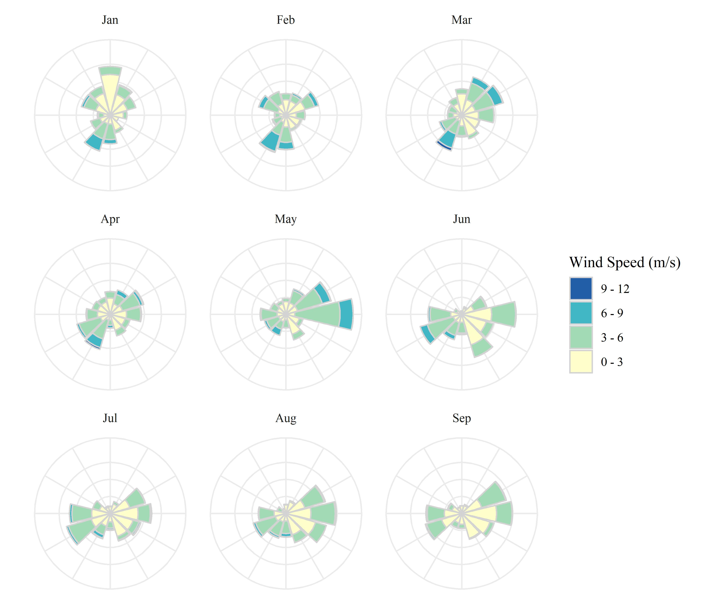

  
  
```{r setup, echo = F, warning = F, message = F, results = 'hide'}
# figure path, chunk options
knitr::opts_chunk$set(fig.path = 'figs/', warning = F, message = F, echo = F, cache = F, dev.args = list(family = 'serif'), dpi = 300, warning = F,
  fig.process = function(x) {
  x2 = sub('-\\d+([.][a-z]+)$', '\\1', x)
  if (file.rename(x, x2)) x2 else x
  })
```

```{r windroses, fig.cap = 'Wind rose plots for 2021 by month. Data are from St. Petersburg, Florida.  Wind roses show relative counts of six minute observations in directional (30 degree bins, north is vertical) and speed (m/s) categories.'}

```


