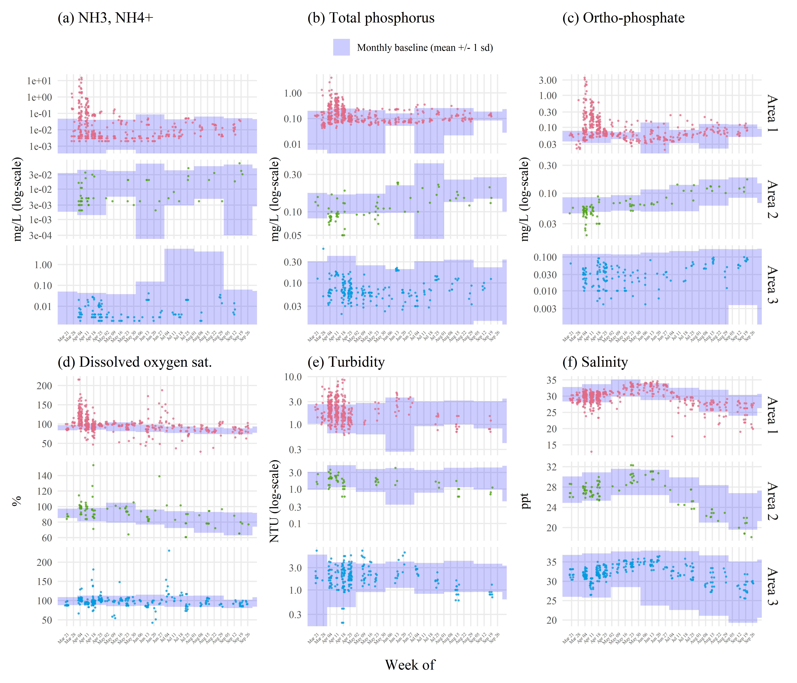
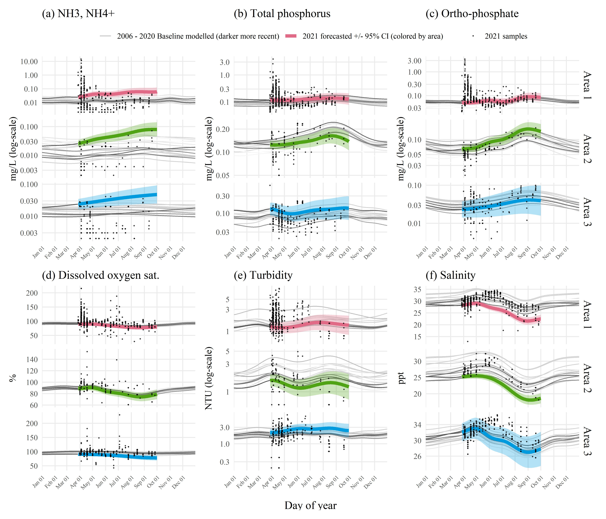
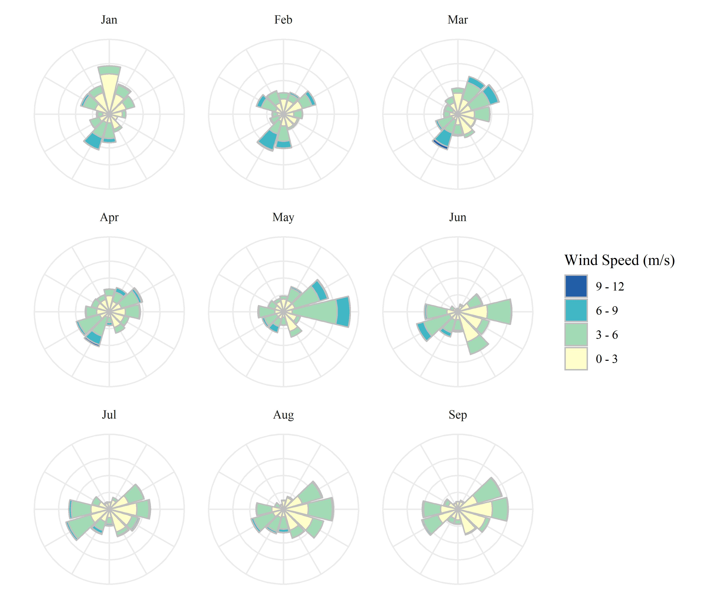
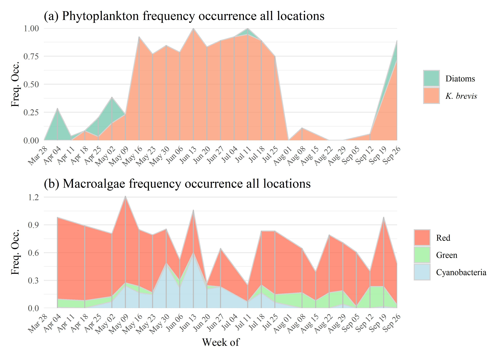
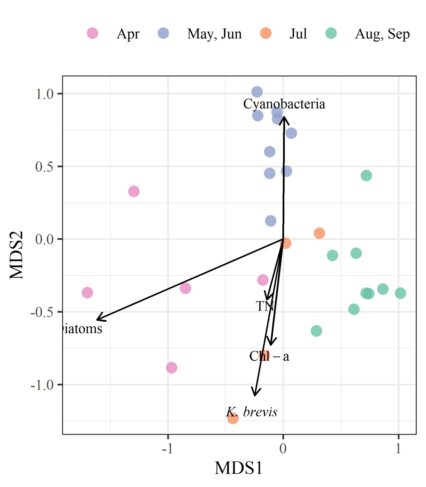

  
  
```{r setup, echo = F, warning = F, message = F, results = 'hide'}
# figure path, chunk options
knitr::opts_chunk$set(fig.path = 'figs/', warning = F, message = F, echo = F, cache = F, dev.args = list(family = 'serif'), dpi = 300, warning = F,
  fig.process = function(x) {
  x2 = sub('-\\d+([.][a-z]+)$', '\\1', x)
  if (file.rename(x, x2)) x2 else x
  })


box::use(
  here[here],
  dplyr[...]
)

load(file = here('tables/mcrfotabsupp.RData'))
load(file = here('tables/savfotabsupp.RData'))
load(file = here('tables/mcrabutabsupp.RData'))
load(file = here('tables/savabutabsupp.RData'))
```

# Data, source materials, and dashboard

All datasets used in this study are provided online in an open access data archive hosted on the Knowledge Network for Biocomplexity as part of the DataOne federated network.  This includes full metadata documentation.  The repository is available and citable at: 

Materials for reproducing the analyses, figures, tables, and other content in this paper are provided in a GitHub repository. This includes a source RMarkdown file [@Xie20] used for the manuscript text.  The repository is available at https://github.com/tbep-tech/piney-point-manu. 

The Piney Point Environmental Monitoring Dashboard can be used to view all data together through an interactive, online application.  It provides a synthesis of data to assess baseline conditions prior to April 2021 and to evaluate changing water quality conditions as new data become available. The dashboard is available at https://shiny.tbep.org and citable at @Beck21c.  

# History of Piney Point 

The Piney Point facility in Palmetto, Florida was established in 1966 by the now defunct Borden Chemicals company near Port Manatee on the southeast shore of lower Tampa Bay. Port operations were primarily for export of phosphate production by the plant.  Numerous environmental issues were observed in these early years, including suspected surface water contamination from Piney Point in nearby Bishop Harbor, groundwater contamination from industrial solvents, and air pollution from plant emissions [@Henderson04].  Ownership of the facility was transferred to different companies over the course of operation and in 1993 the plant was acquired by Mulberry Phosphates, Inc., which also owned a mining facility in Mulberry, Florida to the north.  In 1997, 204 million liters of phosphate mining process water from the Mulberry plant spilled into the Alafia River, the second largest tributary to Tampa Bay, killing 1.3 million fishes [@DiPinto01]. 

The Mulberry corporation filed for bankruptcy in 2001, transferring regulatory oversight of the Piney Point facility to the Florida Department of Environmental Protection (FDEP).  Although phosphate production no longer occurred at the site, focus over the next twenty years centered on containment and treatment of water on-site to minimize environmental impacts.  Despite these efforts, reduced holding capacities and degraded physical integrity of the holding ponds, including degradation of the pond liner, likely contributed to the releases to surficial and ground waters.  For example, tropical storm Gabrielle in 2001 produced 33 centimeters of rain, causing release of over 38 million liters of water from Piney Point into Bishop Harbor, with an estimated 14 metric tons of nitrogen (pers. comm. D. Eckenrod to USEPA, Nov. 28, 2001).  Species of phytoplankton associated with harmful algal blooms were observed around this time [@Garrett11]. Another event lasting from November 2003 to October 2004, treated process water from Piney Point was released to Bishop Harbor to further reduce the likelihood of an uncontrolled spill. @Switzer11 reported minimal impacts to nekton communities, although macroalgal blooms of *Ulva* spp. and *Gracilaria* spp. were observed as a potential indication of nutrient eutrophication. Around the same time, 939 million liters of water from Piney Point were barged and released 193 kilometers offshore to the Gulf of Mexico to reduce strain on the holding capacity of storage ponds [@Hu03].  Efforts for onsite treatment were also increased during this period to increase pH, remove heavy metals, and reduce nutrient concentrations to minimize impacts of unanticipated release to local areas. 

Piney Point was acquired by HRK Holdings, LLC in August 2006 through an administrative agreement with FDEP, where oversight was still maintained by the latter.  This agreement transferred responsibility of the site to HRK with the intention that any future uses must protect and be compatible with the integrity of stack closure and long-term care.  In 2011, HRK agreed to the storage of 1.1 million cubic meters of dredged material and seawater from Port Manatee to improve shipping capacity at the port (i.e., Berth 12 construction).  This material was added to an existing gypstack at Piney Point (NGS-S, the point of release for 2021). Placement of the dredged material was suspected in compromising the liner integrity which led to an emergency release of 640 million liters of dredged saltwater slurry and 3.2 metric tons of nitrogen to receiving waters leading to Bishop Harbor. The dredging and deposit of slurry at Piney Point continued following structural fortifications to the holding stacks to ensure integrity with additional loadings.  HRK maintains ownership and responsibility of the site to present day with oversight by FDEP.

# Sampling methods 

Established laboratory and field sample protocols for all survey methods were based on an [Interagency Monitoring Project Plan](https://drive.google.com/drive/u/0/folders/1oBGvjdve-Gpo4Kn3Ovn8a8-yVoP25eec) maintained by the TBEP in agreement with USEPA standards and those of the inter-agency partners.  Data quality objectives followed guidelines outlined in the TBEP Data Quality Management Plan [@tbep1620]. Many of the local partners also participate in the Southwest Florida [Regional Ambient Monitoring Program](https://tbep.org/our-work/boards-committees/technical-advisory-committee/#ramp) (RAMP) that ensures similar standards and protocols are followed in the collection and processing of monitoring data, including routine cross-reference of samples between laboratories to check precision of measured values.  Discrete water quality samples were taken primarily from surface grabs by boat and processed for relevant parameters (see below) by the respective laboratories of each participating agency.  Surface samples requiring laboratory analysis (e.g., nutrient assays) were obtained primarily from bottle collection at the surface, whereas in situ measurements were available for many parameters (e.g., dissolved oxygen, secchi depth, etc.).  In situ measurements were collected using common monitoring equipment, such as YSI sondes or Seabird CTD casts depending on monitoring agency.  Laboratory methods used to process samples were based on accepted procedures promoted through the Southwest Florida RAMP.

For data analysis in this paper, we focus on water quality parameters related to the Tampa Bay nutrient management paradigm and the expected phytoplankton response from a dense, inorganic nitrogen plume entering the bay.  This included statistical evaluation of total nitrogen (mg/L), total ammonia nitrogen (NH$_3$ + NH$_4^+$, mg/L), nitrate/nitrite (NO$_3^-$ + NO$_2^-$, mg/L), total phosphorus (mg/L), orthophosphate (PO$_4^{3-}$, mg/L), and chlorophyll-a (ug/L) concentrations.  Samples for pH, salinity (psu), temperature (C), and dissolved oxygen saturation (\%) were also evaluated given the role these parameters can have as indicators of surface water contamination (pH), physical drivers of primary production (salinity, temperature), and indicators of primary production and respiration (dissolved oxygen, mg/L).  Overall, sample frequency was approximately biweekly over the subsequent months, with some variability given agency resource limitations during the event and weather restrictions on boating.  As appropriate, water quality data were aggregated at the weekly scale and by major areas of interest (Figure 1a) given the hypothesized impacts adjacent to the release site as indicated by the TBCOM tracer model simulated plume patterns.  

Phytoplankton samples were also collected by multiple partners and included a mix of quantitative samples from light microscopy that enumerated major taxa by cell concentrations and qualitative presence/absence samples.  Taxa were aggregated into major groups of interest for Tampa Bay, with a focus on diatoms (Bacillariophyta and other centric taxa), as common primary producers observed throughout the growing season, and species associated with harmful algal blooms (HABs), as a potentially adverse outcome of these species outcompeting others in response to nutrient inputs from Piney Point.  Evaluation herein of HABs data included specific focus on the red tide organism *Karenia brevis*.  Data for *K. brevis* were obtained from event-based monitoring samples collected by FWC and available from a joint FWC-USF short-term red tide tracking product (http://ocgweb.marine.usf.edu/hab_tracking/wfcom_hab.html) and from the Harmful Algal BloomS Observing System ([HABSOS](https://habsos.noaa.gov/)).  Because of the increased occurrence of red tide in July following the emergency release, fish kill reports from FWC were also evaluated in relation to key municipalities (Tampa, St. Petersberg) impacted by the event. Fish kill reports were obtained from the FWC [online database](https://public.myfwc.com/fwri/FishKillReport/searchresults.aspx) that provides reports received by FWC via the state's Marine Fish Kill Hotline. 

Seagrass and macroalgae transect samples were collected approximately biweekly at locations around Piney Point from April to early October 2021.  Each year, the TBEP coordinates inter-agency sampling among regional partners at over sixty fixed locations throughout the bay [@Sherwood17]. Because of the time-sensitive nature of the potential impacts of pollutants from Piney Point on seagrasses near Piney Point, the sampling protocol used at the routine monitoring locations was modified using a "rapid survey" design to sample seagrasses and macroalgae along 50 m transects at several of the long-term monitoring sites, as well as new locations selected along the shore and small subembayments (e.g., Bishop Harbor) to provide a more comprehensive coverage of the seagrass community near Piney Point (Figure 1b).  This rapid survey design was created by the "[Eyes on Seagrass](http://blogs.ifas.ufl.edu/news/2019/03/19/citizen-scientists-needed-to-survey-seagrass-seaweed-in-charlotte-harbor/)" citizen science group working in Charlotte Harbor, Florida, coordinated in part by the University of Florida, Institute of Food and Agricultural Sciences extension program and Florida Sea Grant. Seagrasses and macroalgae were identified and Braun-Blanquet abundances were estimated within a 0.25 m$^2$ quadrat at 10m distances along each transect.  Dominant seagrass species in the bay include *Halodule wrightii*, *Syringodium filiforme*, and *Thalassia testudinum*.  Other seagrass species (i.e., *Halophila* spp., *Ruppia maritima*) were also observed but were present at much lower abundances and were not evaluated herein.  Macroalgae taxa were aggregated by major group (i.e., red, green, and cyanobacteria).  Seagrasses and macroalgae abundances were converted to frequency of occurrence estimates (i.e., number of locations present divided by total locations sampled) at the transect scale or within major areas (Figure 1a) depending on the analysis.  

# Figures

```{r wqtrnds-supp, fig.cap = 'Sampled water quality data by week for late March through September 2021 following the release from Piney Point for (a) total nitrogen (mg/L), (b) chlorophyll-a (ug/L), and (c) secchi disk depth (meters).  Observations are aggregated by week and within assessment areas shown in Figure 1a.  Normal ranges for the month of observation (monthly baseline) and area are shown by the blue shaded areas. Normal ranges are defined as within +/-1 standard deviation of the mean for the month of observation from 2006 to 2021 for values collected at long-term monitoring sites within each area (Figure 1a).'}
knitr::include_graphics(here('figs/wqtrnds-supp.jpeg'))
```

```{r wqtrndsadd-supp, fig.cap = 'Sampled water quality data by week for late March through September 2021 following the release from Piney Point for (a) total ammonia nitogen (mg/L), (b) total phosphorus (mg/L), (c) orthophosphate (mg/L), (d) dissolved oxygen saturation (%), (e) turbidity (NTU), and (f) salinity (ppt).  Observations are aggregated by week and within assessment areas shown in Figure 1a.  Normal ranges for the month of observation (monthly baseline) and area are shown by the blue shaded areas. Normal ranges are defined as within +/-1 standard deviation of the mean for the month of observation from 2006 to 2020 for values collected at long-term monitoring sites within each area (Figure 1a).'}

```

```{r wqgamadd-supp, fig.cap = 'Forecasted 2021 (a) total ammonia nitogen (mg/L), (b) orthophosphate (mg/L), (c) total phosphorus (mg/L), (d) dissolved oxygen saturation (%), (e) turbidity (NTU), and (f) salinity (ppt) by area based on historal seasonal models. Forecasts from the historical models for dates during and after the Piney Point release are shown in thick lines (+/- 95% confidence), with observed samples overlaid on the plots to emphasize deviation of 2021 data from historical seasonal estimates.  Forecasted values are based on Generalized Additive Models fit to historical baseline data from 2006 to early 2021, where historical predictions are shown as thin grey lines, with darker lines for more recent years. Results are grouped by assessment areas shown in Figure 1a.'}

```

```{r trnabu-supp, fig.cap = 'Abundance estimates (+/- 95% confidence) for (a) Area 1 and (b) Area 3 (see map in Figure 1a for locations) for macroalgae (top) and seagrass (bottom) rapid response transect surveys across all transects (n = 38) near Piney Point.  Estimates are grouped by sample months in 2021. Points are offset slightly for readability. No transects were sampled in Area 2 to the north of Piney Point and no transects were sampled past September in Area 1 given allocated sampling effort following projected dispersal patterns of the plume from model simulations.'}
knitr::include_graphics(here('figs/trnabu-supp.jpeg'))
```

```{r windroses-supp, fig.cap = 'Wind rose plots for 2021 by month. Data are from St. Petersburg, Florida.  Wind roses show relative counts of six minute observations in directional (30 degree bins, north is vertical) and speed (m/s) categories.'}

```

```{r phymcrfoest-supp, fig.cap = 'Frequency occurrence estimates for (a) phytoplankton (diatoms and *K. brevis*) and (b) macroalgae groups. Frequency occurrence estimates are aggregated by week of observation based on all sample locations where a phytoplankton or macroalgal taxa was observed divided by all sample locations in a week.  Estimates are not additive and are specific to each taxa.  Sample dates are noted by vertical grey lines in each plot. Diatoms are based on presence/absense of *Asterionellopsis sp*. and *Skeletonema sp*.  Note that frequency occurrence is not a precise measure of cell concentrations.'}

```

```{r nutrientfloword-supp, fig.cap = 'Ordination results comparing weekly summarized observations across all sampled locations for total nitrogen concentrations, chlorophyll-a concentrations, diatom cell concentrations, *Karenia brevis* cell concentrations, and cyanobacteria macroalgal abundances.  Ordination results are from non-metric multi-dimensional scaling performed on the 97.5th percentile values of observations in each week for each parameter.  Observations are grouped by month periods based on phytoplankton (diatoms or *K. brevis*) or macroalgal dominance.'}

```

# Tables

```{r mcrfotabsupp}
cap.val <- 'Comparison of macroalgae frequency occurrence by areas of interest (Figure 1a) and month.  Overall signifance of differences of frequency occurrence between months for macroalgae groups and area combination are shown with Chi-squared statistics based on Kruskall-Wallis rank sum tests.  Multiple comparisons with Mann-Whitney U tests (Comp. column) were used to evaluate pairwise monthly frequency occurrences for each macroalgae group in each area.  Rows that share a letter within each area and macroalgae group combination have frequency occurrences that are not significantly different between month pairs. Data are not seasonally-corrected due to limited long-term seasonal observations. ** p < 0.005, * p < 0.05, blank is not significant at $\\alpha$ = 0.05.'
totab <- mcrfotabsupp %>% 
  select(-pval)
knitr::kable(totab, booktabs = T, caption = cap.val)
```

```{r savfotabsupp}
cap.val <- 'Comparison of seagrass species frequency occurrence by areas of interest (Figure 1a) and month.  Overall signifance of differences of frequency occurrence between months for seagrass species and area combination are shown with Chi-squared statistics based on Kruskall-Wallis rank sum tests.  Multiple comparisons with Mann-Whitney U tests (Comp. column) were used to evaluate pairwise monthly frequency occurrences for each seagrass species in each area.  Rows that share a letter within each area and seagrass species combination have frequency occurrences that are not significantly different between month pairs. Data are not seasonally-corrected due to limited long-term seasonal observations. ** p < 0.005, * p < 0.05, blank is not significant at $\\alpha$ = 0.05.'
totab <- savfotabsupp %>% 
  select(-pval)
knitr::kable(totab, booktabs = T, caption = cap.val)
```

```{r mcrabutabsupp}
cap.val <- 'Comparison of macroalgae Braun-Blanquet abundances by areas of interest (Figure 1a) and month.  Overall signifance of differences of abundances between months for macroalgae groups and area combination are shown with Chi-squared statistics based on Kruskall-Wallis rank sum tests.  Multiple comparisons with Mann-Whitney U tests (Comp. column) were used to evaluate pairwise monthly abundances for each macroalgae group in each area.  Rows that share a letter within each area and macroalgae group combination have abundances that are not significantly different between month pairs. Data are not seasonally-corrected due to limited long-term seasonal observations. ** p < 0.005, * p < 0.05, blank is not significant at $\\alpha$ = 0.05.'
totab <- mcrabutabsupp %>% 
  select(-pval)
knitr::kable(totab, booktabs = T, caption = cap.val)
```

```{r savabutabsupp}
cap.val <- 'Comparison of seagrass species Braun-Blanquet abundances by areas of interest (Figure 1a) and month.  Overall signifance of differences of abundances between months for seagrass species and area combination are shown with Chi-squared statistics based on Kruskall-Wallis rank sum tests.  Multiple comparisons with Mann-Whitney U tests (Comp. column) were used to evaluate pairwise monthly abudances for each seagrass species in each area.  Rows that share a letter within each area and seagrass species combination have abundances that are not significantly different between month pairs. Data are not seasonally-corrected due to limited long-term seasonal observations. ** p < 0.005, * p < 0.05, blank is not significant at $\\alpha$ = 0.05.'
totab <- savabutabsupp %>% 
  select(-pval)
knitr::kable(totab, booktabs = T, caption = cap.val)
```

# References
