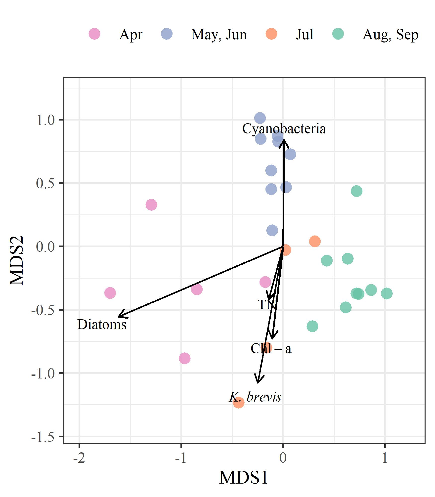

  
  
```{r setup, echo = F, warning = F, message = F, results = 'hide'}
# figure path, chunk options
knitr::opts_chunk$set(fig.path = 'figs/', warning = F, message = F, echo = F, cache = F, dev.args = list(family = 'serif'), dpi = 300, warning = F,
  fig.process = function(x) {
  x2 = sub('-\\d+([.][a-z]+)$', '\\1', x)
  if (file.rename(x, x2)) x2 else x
  })


box::use(
  here[here],
  dplyr[...]
)

load(file = here('tables/mcrfotabsupp.RData'))
load(file = here('tables/savfotabsupp.RData'))
load(file = here('tables/mcrabutabsupp.RData'))
load(file = here('tables/savabutabsupp.RData'))
```

# History of Piney Point 

The Piney Point facility in Palmetto, Florida was established in 1966 by the now defunct Borden Chemicals company near Port Manatee on the southeast shore of lower Tampa Bay. Port operations were primarily for export of phosphate production by the plant.  Numerous environmental issues were observed in these early years, including suspected wastewater contamination in nearby Bishop Harbor, groundwater contamination from industrial solvents, and air pollution from plant emissions [@Henderson04].  Ownership of the facility was transferred to different companies over the course of operation and in 1993 the plant was acquired by Mulberry Phosphates, Inc., which also owned a mining facility in Mulberry, Florida to the north.  In 1997, 54 million gallons of phosphate mining process water from the Mulberry plant spilled into the Alafia River, the second largest tributary to Tampa Bay, killing 1.3 million fishes and impacting 153 hectares of wetland habitat. 

The Mulberry corporation filed for bankruptcy in 2001, transferring regulatory oversight of the Piney Point facility to FDEP.  Although phosphate production no longer occurred at the site, focus over the next twenty years centered on containment and treatment of wastewater on-site to minimize environmental impacts.  Despite these efforts, reduced holding capacities and degraded physical integrity of the holding ponds likely contributed to discharge events to surficial and ground waters.  Tropical storm Gabrielle in 2001 produced 13 inches of rain, causing over 10 million gallons of wastewater to be released into Bishop Harbor, with an estimated 15.4 tons of nitrogen (pers. comm. D. Eckenrod to USEPA, Nov. 28, 2001).  Species of phytoplankton associated with harmful algal blooms were observed around this time [@Garrett11]. From November 2003 to October 2004, treated process water from Piney Point was discharged to Bishop Harbor to further reduce the likelihood of an uncontrolled spill. @Switzer11 reported minimal impacts to nekton communities, although macroalgal blooms of *Ulva spp.* and *Gracilaria spp.* were observed as a potential indication of nutrient eutrophication. Around the same time, 248 million gallons of wastewater from Piney Point were barged 120 miles offshore to the Gulf of Mexico to reduce strain on the holding capacity of storage ponds [@Hu03].  Efforts for onsite treatment were also increased during this period to increase pH, remove heavy metals, and reduce nutrient concentrations to minimize impacts of discharge to local areas. 

HRK acquired Piney Point in August 2006 through an administrative agreement with FDEP.  This agreement transferred responsibility of the site to HRK with the intention that any future uses must protect and be compatible with the integrity of stack closure and long-term care.  In 2011, HRK agreed to the storage of 1.5 million cubic yards of dredged material and seawater from Port Manatee to improve shipping capacity at the port (i.e., Berth 12 construction).  This material was added to an existing gypstack at Piney Point. Placement of the dredged material was suspected in compromising the liner integrity which led to an emergency discharge that released 169 million gallons of dredged saltwater slurry and 3.5 tons of nitrogen to receiving waters leading to Bishop Harbor. The dredging and deposit of slurry at Piney Point continued following structural fortifications to the holding stacks to ensure integrity with additional loadings.  HRK maintains ownership and responsibility of the site to present day with oversight by FDEP.

# Figures

```{r wqtrnds-supp, fig.cap = 'Sampled water quality data by week for April to July 2021 in response to wastewater discharge from Piney Point for (a) total nitrogen (mg/L), (b) chlorophyll-a (ug/L), and (c) secchi disk depth (meters).  Observations are aggregated by week and within assessment areas shown in Figure 1a.  Normal ranges for the month of observation (monthly baseline) and area are shown by the blue shaded areas. Normal ranges are defined as within +/-1 standard deviation of the mean for the month of observation from 2006 to 2021 for values collected at long-term monitoring sites within each area (Figure 1a).'}
knitr::include_graphics(here('figs/wqtrnds-supp.jpeg'))
```

```{r wqtrndsadd-supp, fig.cap = 'Sampled water quality data by week for April to September 2021 in response to wastewater discharge from Piney Point for (a) total ammonia nitogen (mg/L), (b) orthophosphate (mg/L), (c) total phosphorus (mg/L), (d) dissolved oxygen saturation (%), (e) turbidity (NTU), and (f) salinity (ppt).  Observations are aggregated by week and within assessment areas shown in Figure 1a.  Normal ranges for the month of observation (monthly baseline) and area are shown by the blue shaded areas. Normal ranges are defined as within +/-1 standard deviation of the mean for the month of observation from 2006 to 2020 for values collected at long-term monitoring sites within each area (Figure 1a).'}
knitr::include_graphics('figs/wqtrndsadd-supp.jpeg')
```

```{r wqgamadd-supp, fig.cap = 'Forecasted 2021 (a) total ammonia nitogen (mg/L), (b) orthophosphate (mg/L), (c) total phosphorus (mg/L), (d) dissolved oxygen saturation (%), (e) turbidity (NTU), and (f) salinity (ppt) by area based on historal seasonal models. Forecasts from the historical models for dates during and after the Piney Point discharge are shown in thick lines (+/- 95% confidence), with observed samples overlaid on the plots to emphasize deviation of 2021 data from historical seasonal estimates.  Forecasted values are based on Generalized Additive Models fit to historical baseline data from 2006 to early 2021, with darker lines for more recent years. Results are grouped by assessment areas shown in Figure 1a.'}

```

```{r trnabu-supp, fig.cap = 'Abundance estimates (+/- 95% confidence) for (a) area 1 and (b) area 3 (Figure 1a) for macroalgae (top) and seagrass (bottom) rapid response transect surveys across all transects (n = 38) near Piney Point.  Estimates are grouped by sample months in 2021. Points are offset slightly for readability.'}
knitr::include_graphics(here('figs/trnabu-supp.jpeg'))
```

```{r windroses-supp, fig.cap = 'Wind rose plots for 2021 by month. Data are from St. Petersburg, Florida.  Wind roses show relative counts of six minute observations in directional (30 degree bins, north is vertical) and speed (m/s) categories.'}
knitr::include_graphics('figs/windroses-supp.jpeg')
```

```{r phymcrfoest-supp, fig.cap = 'Frequency occurrence estimates for (a) phytoplankton (diatoms and *K. brevis*) and (b) macroalgae groups. Frequency occurrence estimates are aggregated by week of observation based on all sample locations where a phytoplankton or macroalgal taxa was observed divided by all sample locations in a week.  Estimates are not additive and are specific to each taxa.  Sample dates are noted by vertical grey lines in each plot. Diatoms are based on presence/absense of *Asterionellopsis sp*. and *Skeletonema sp*.  Note that frequency occurrence is not a precise measure of cell concentrations.'}
knitr::include_graphics('figs/phymcrfoest-supp.jpeg')
```

```{r nutrientfloword-supp, fig.cap = 'Ordination results comparing weekly summarized observations across all sampled locations for total nitrogen concentrations, chlorophyll-a concentrations, diatom cell concentrations, *Karenia brevis* cell concentrations, and cyanobacteria macroalgal abundances.  Ordination results are from non-metric multi-dimensional scaling performed on the 97.5th percentile values of observations in each week for each parameter.  Observations are grouped by month periods based on phytoplankton (diatoms or *K. brevis*) or macroalgal dominance.'}

```

# Tables

```{r mcrfotabsupp}
cap.val <- 'Comparison of macroalgae frequency occurrence by areas of interest (Figure 1a) and month.  Overall signifance of differences of frequency occurrence between months for macroalgae groups and area combination are shown with Chi-squared statistics based on Kruskall-Wallis rank sum tests.  Multiple comparisons with Mann-Whitney U tests (Comp. column) were used to evaluate pairwise monthly frequency occurrences for each macroalgae group in each area.  Rows that share a letter within each area and macroalgae group combination have frequency occurrences that are not significantly different between month pairs. Probability values were adjusted for the pairwise comparisons using the Bonferroni method in @Holm79. ** p < 0.005, * p < 0.05, blank is not significant at $\\alpha$ = 0.05.'
totab <- mcrfotabsupp %>% 
  select(-pval)
knitr::kable(totab, booktabs = T, caption = cap.val)
```

```{r savfotabsupp}
cap.val <- 'Comparison of seagrass species frequency occurrence by areas of interest (Figure 1a) and month.  Overall signifance of differences of frequency occurrence between months for seagrass species and area combination are shown with Chi-squared statistics based on Kruskall-Wallis rank sum tests.  Multiple comparisons with Mann-Whitney U tests (Comp. column) were used to evaluate pairwise monthly frequency occurrences for each seagrass species in each area.  Rows that share a letter within each area and seagrass species combination have frequency occurrences that are not significantly different between month pairs. Probability values were adjusted for the pairwise comparisons using the Bonferroni method in @Holm79. ** p < 0.005, * p < 0.05, blank is not significant at $\\alpha$ = 0.05.'
totab <- savfotabsupp %>% 
  select(-pval)
knitr::kable(totab, booktabs = T, caption = cap.val)
```

```{r mcrabutabsupp}
cap.val <- 'Comparison of macroalgae Braun-Blanquet abundances by areas of interest (Figure 1a) and month.  Overall signifance of differences of abundances between months for macroalgae groups and area combination are shown with Chi-squared statistics based on Kruskall-Wallis rank sum tests.  Multiple comparisons with Mann-Whitney U tests (Comp. column) were used to evaluate pairwise monthly abundances for each macroalgae group in each area.  Rows that share a letter within each area and macroalgae group combination have abundances that are not significantly different between month pairs. Probability values were adjusted for the pairwise comparisons using the Bonferroni method in @Holm79. ** p < 0.005, * p < 0.05, blank is not significant at $\\alpha$ = 0.05.'
totab <- mcrabutabsupp %>% 
  select(-pval)
knitr::kable(totab, booktabs = T, caption = cap.val)
```

```{r savabutabsupp}
cap.val <- 'Comparison of seagrass species Braun-Blanquet abundances by areas of interest (Figure 1a) and month.  Overall signifance of differences of abundances between months for seagrass species and area combination are shown with Chi-squared statistics based on Kruskall-Wallis rank sum tests.  Multiple comparisons with Mann-Whitney U tests (Comp. column) were used to evaluate pairwise monthly abudances for each seagrass species in each area.  Rows that share a letter within each area and seagrass species combination have abundances that are not significantly different between month pairs. Probability values were adjusted for the pairwise comparisons using the Bonferroni method in @Holm79. ** p < 0.005, * p < 0.05, blank is not significant at $\\alpha$ = 0.05.'
totab <- savabutabsupp %>% 
  select(-pval)
knitr::kable(totab, booktabs = T, caption = cap.val)
```

# References
