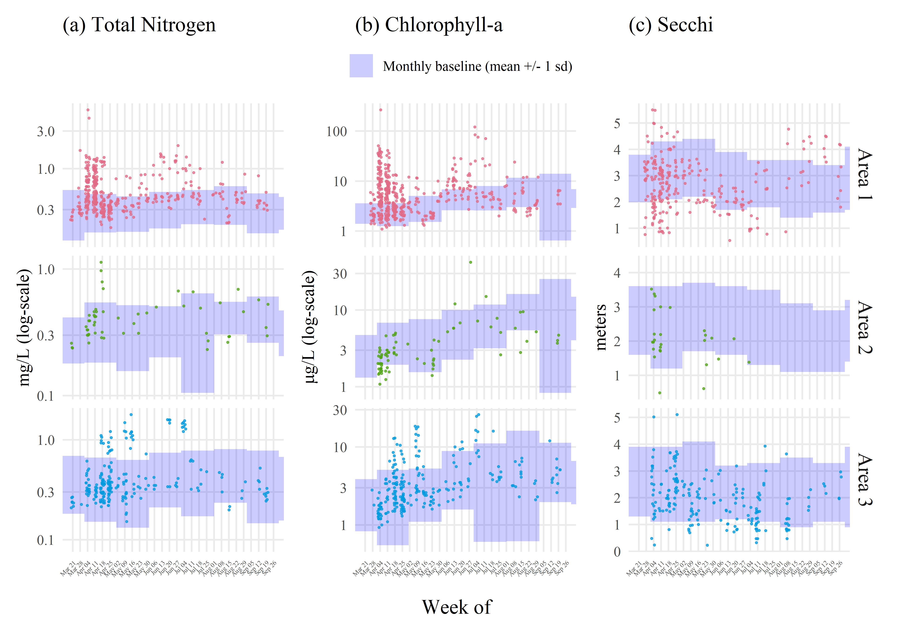

  
  
```{r setup, echo = F, warning = F, message = F, results = 'hide'}
# figure path, chunk options
knitr::opts_chunk$set(fig.path = 'figs/', warning = F, message = F, echo = F, cache = F, dev.args = list(family = 'serif'), dpi = 300, warning = F,
  fig.process = function(x) {
  x2 = sub('-\\d+([.][a-z]+)$', '\\1', x)
  if (file.rename(x, x2)) x2 else x
  })


box::use(
  here[here],
  dplyr[...]
)

load(file = here('tables/mcrfotab.RData'))
load(file = here('tables/savfotab.RData'))
load(file = here('tables/mcrabutab.RData'))
load(file = here('tables/savabutab.RData'))
```

# Figures

```{r wqtrnds-supp, fig.cap = 'Sampled water quality data by week for April to September 2021 in response to wastewater discharge from Piney Point for (a) total ammonia nitogen (mg/L), (b) orthophosphate (mg/L), (c) total phosphorus (mg/L), (d) dissolved oxygen saturation (%), (e) turbidity (NTU), and (f) salinity (ppt).  Observations are aggregated by week and within assessment areas shown in Figure 1a.  Normal ranges for the month of observation (monthly baseline) and area are shown by the blue shaded areas. Normal ranges are defined as within +/-1 standard deviation of the mean for the month of observation from 2006 to 2020 for values collected at long-term monitoring sites within each area (Figure 1a).'}

```

```{r wqgamtrnds-supp, fig.cap = 'Predicted (a) total ammonia nitogen (mg/L), (b) orthophosphate (mg/L), (c) total phosphorus (mg/L), (d) dissolved oxygen saturation (%), (e) turbidity (NTU), and (f) salinity (ppt) by area based on historal seasonal models.  Estimated trends are based on Generalized Additve Models fit to historical basline data from 2006 to early 2021.  Predicted trends from the historical models for dates during and after the Piney Point discharge are shown in thick lines (+/- 95% confidence), with observed samples overlaid on the plots.  Results are grouped by assessment areas shown in Figure 1a.'}
knitr::include_graphics('figs/wqgamtrnds-supp.jpeg')
```

```{r trnabu, fig.cap = 'Abundance estimates (+/- 95% confidence) for (a) area 1 and (b) area 3 (Figure 1a) for macroalgae (top) and seagrass (bottom) rapid response transect surveys across all transects (n = 38) near Piney Point.  Estimates are grouped by sample months in 2021. Points are offset slightly for readability.'}
knitr::include_graphics(here('figs/trnabu.jpeg'))
```

```{r windroses, fig.cap = 'Wind rose plots for 2021 by month. Data are from St. Petersburg, Florida.  Wind roses show relative counts of six minute observations in directional (30 degree bins, north is vertical) and speed (m/s) categories.'}
knitr::include_graphics('figs/windroses.jpeg')
```

```{r phymcrfoest, fig.cap = 'Frequency occurrence estimates for (a) phytoplankton (diatoms and *K. brevis*) and (b) macroalgae groups. Frequency occurrence estimates are aggregated by week of observation based on all sample locations where a phytoplankton or macroalgal taxa was observed divided by all sample locations in a week.  Estimates are not additive and are specific to each taxa.  Sample dates are noted by vertical grey lines in each plot. Diatoms are based on presence/absense of *Asterionellopsis sp*. and *Skeletonema sp*.  Note that frequency occurrence is not a precise measure of cell concentrations.'}
knitr::include_graphics('figs/phymcrfoest.jpeg')
```

# Tables

```{r mcrfotab}
cap.val <- 'Comparison of macroalgae frequency occurrence by areas of interest (Figure \\@ref(fig:map)a) and month.  Overall signifance of differences of frequency occurrence between months for macroalgae groups and area combination are shown with Chi-squared statistics based on Kruskall-Wallis rank sum tests.  Multiple comparisons with Mann-Whitney U tests (Comp. column) were used to evaluate pairwise monthly frequency occurrences for each macroalgae group in each area.  Rows that share a letter within each area and macroalgae group combination have frequency occurrences that are not significantly different between month pairs. Probability values were adjusted for the pairwise comparisons using the Bonferroni method in @Holm79. ** p < 0.005, * p < 0.05, blank is not significant at $\\alpha$ = 0.05.'
totab <- mcrfotab %>% 
  select(-pval)
knitr::kable(totab, booktabs = T, caption = cap.val)
```

```{r savfotab}
cap.val <- 'Comparison of seagrass species frequency occurrence by areas of interest (Figure \\@ref(fig:map)a) and month.  Overall signifance of differences of frequency occurrence between months for seagrass species and area combination are shown with Chi-squared statistics based on Kruskall-Wallis rank sum tests.  Multiple comparisons with Mann-Whitney U tests (Comp. column) were used to evaluate pairwise monthly frequency occurrences for each seagrass species in each area.  Rows that share a letter within each area and seagrass species combination have frequency occurrences that are not significantly different between month pairs. Probability values were adjusted for the pairwise comparisons using the Bonferroni method in @Holm79. ** p < 0.005, * p < 0.05, blank is not significant at $\\alpha$ = 0.05.'
totab <- savfotab %>% 
  select(-pval)
knitr::kable(totab, booktabs = T, caption = cap.val)
```

```{r mcrabutab}
cap.val <- 'Comparison of macroalgae Braun-Blanquet abundances by areas of interest (Figure \\@ref(fig:map)a) and month.  Overall signifance of differences of abundances between months for macroalgae groups and area combination are shown with Chi-squared statistics based on Kruskall-Wallis rank sum tests.  Multiple comparisons with Mann-Whitney U tests (Comp. column) were used to evaluate pairwise monthly abundances for each macroalgae group in each area.  Rows that share a letter within each area and macroalgae group combination have abundances that are not significantly different between month pairs. Probability values were adjusted for the pairwise comparisons using the Bonferroni method in @Holm79. ** p < 0.005, * p < 0.05, blank is not significant at $\\alpha$ = 0.05.'
totab <- mcrabutab %>% 
  select(-pval)
knitr::kable(totab, booktabs = T, caption = cap.val)
```

```{r savabutab}
cap.val <- 'Comparison of seagrass species Braun-Blanquet abundances by areas of interest (Figure \\@ref(fig:map)a) and month.  Overall signifance of differences of abundances between months for seagrass species and area combination are shown with Chi-squared statistics based on Kruskall-Wallis rank sum tests.  Multiple comparisons with Mann-Whitney U tests (Comp. column) were used to evaluate pairwise monthly abudances for each seagrass species in each area.  Rows that share a letter within each area and seagrass species combination have abundances that are not significantly different between month pairs. Probability values were adjusted for the pairwise comparisons using the Bonferroni method in @Holm79. ** p < 0.005, * p < 0.05, blank is not significant at $\\alpha$ = 0.05.'
totab <- savabutab %>% 
  select(-pval)
knitr::kable(totab, booktabs = T, caption = cap.val)
```

